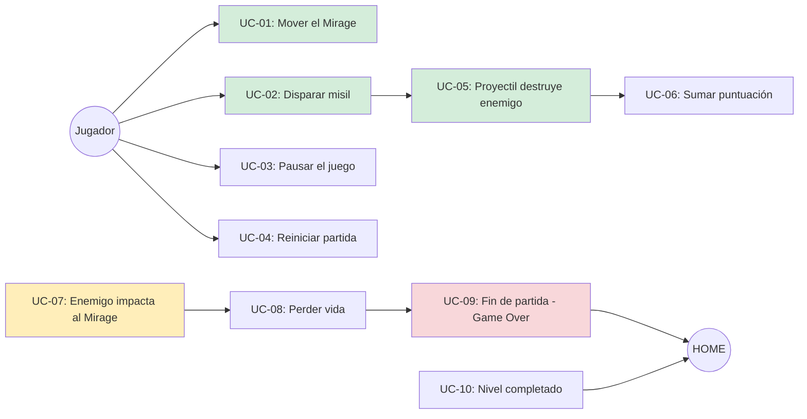
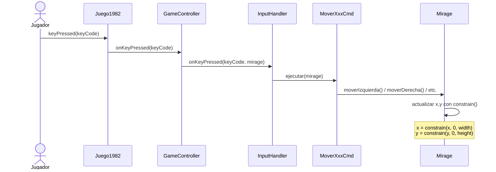
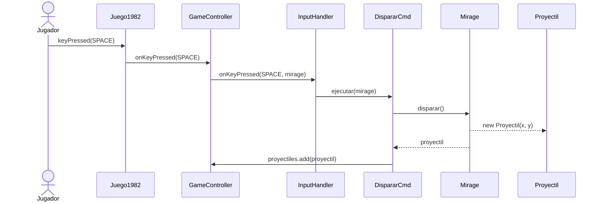
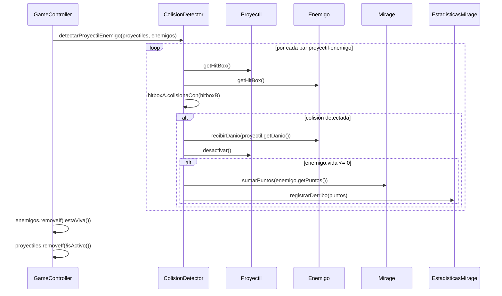
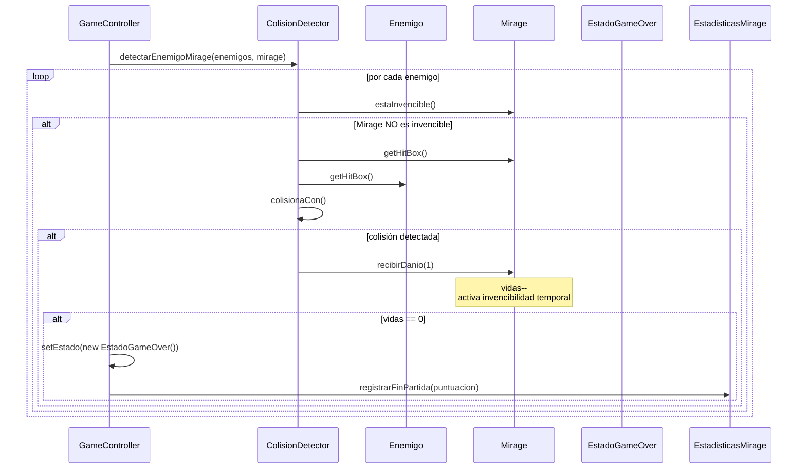
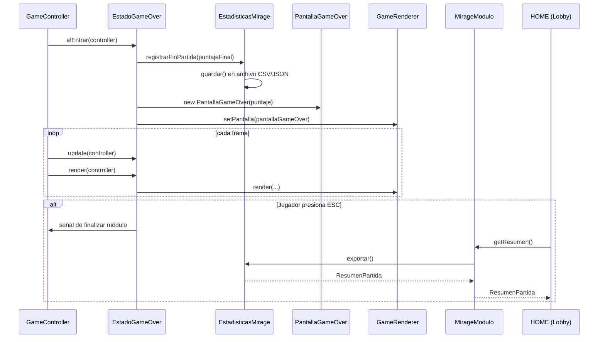

# Casos de Uso — Módulo Mirage

> TPI Algoritmos 1 · 2026 1° Cuatrimestre  
> Cubre p8 del TPI: al menos 5 casos de uso con alta interacción entre clases

---

## Actores

| Actor | Descripción |
|-------|-------------|
| **Jugador** | Persona que usa el teclado para controlar el Mirage |
| **Sistema** | El módulo Mirage ejecutándose en Processing |
| **HOME** | Lobby del juego que lanza y recibe resultados del módulo |

---

## Diagrama general de casos de uso

---

## UC-01: Mover el Mirage

**Actor:** Jugador  
**Precondición:** Estado = JUGANDO, Mirage vivo  
**Postcondición:** Posición del Mirage actualizada dentro de los límites de pantalla

---

## UC-02: Disparar misil

**Actor:** Jugador  
**Precondición:** Estado = JUGANDO, Mirage vivo  
**Postcondición:** Nuevo `Proyectil` agregado a la lista de proyectiles activos

---

## UC-03: Proyectil destruye enemigo

**Actor:** Sistema  
**Precondición:** Proyectil activo y Enemigo activo en pantalla  
**Postcondición:** Enemigo destruido, puntos sumados al Mirage

---

## UC-04: Enemigo impacta al Mirage

**Actor:** Sistema  
**Precondición:** Enemigo activo colisiona con la HitBox del Mirage, Mirage no invencible  
**Postcondición:** Mirage pierde una vida y entra en estado invencible

---

## UC-05: Fin de partida (Game Over)

**Actor:** Sistema  
**Precondición:** Mirage sin vidas  
**Postcondición:** Estadísticas guardadas, pantalla Game Over visible, HOME puede solicitar resumen

---

## Resumen de casos de uso

| ID | Caso de uso | Clases principales involucradas |
|----|-------------|--------------------------------|
| UC-01 | Mover el Mirage | `InputHandler`, `MoverXxxCmd`, `Mirage` |
| UC-02 | Disparar misil | `InputHandler`, `DispararCmd`, `Mirage`, `Proyectil` |
| UC-03 | Proyectil destruye enemigo | `ColisionDetector`, `HitBox`, `Proyectil`, `Enemigo`, `Mirage` |
| UC-04 | Enemigo impacta al Mirage | `ColisionDetector`, `HitBox`, `Mirage`, `EstadoGameOver` |
| UC-05 | Fin de partida (Game Over) | `EstadoGameOver`, `EstadisticasMirage`, `PantallaGameOver`, `MirageModulo` |
| UC-06 | Pausar el juego | `GameController`, `EstadoPausado` |
| UC-07 | Nivel completado | `NivelMirage`, `EstadisticasMirage`, `MirageModulo`, `HOME` |
