# Casos de Uso — Módulo Mirage

> TPI Algoritmos 1 · 2026 1° Cuatrimestre  
> Cubre p8 del TPI: al menos 5 casos de uso con alta interacción entre clases

---

## Actores

| Actor | Descripción |
|-------|-------------|
| **Jugador** | Persona que usa el teclado para controlar el Mirage |
| **Sistema** | El módulo Mirage ejecutándose en Processing |
| **HOME** | Lobby del juego que lanza y recibe resultados del módulo |

---

## Diagrama general de casos de uso

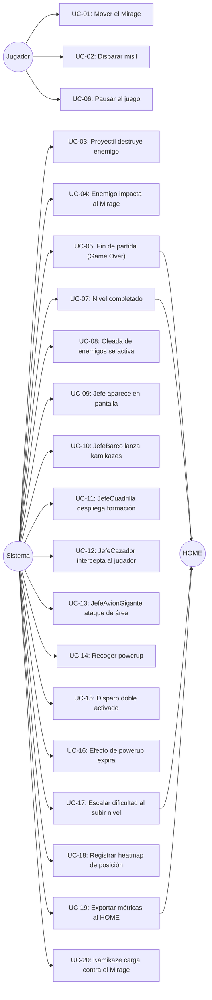

---

## Resumen de casos de uso

| ID | Caso de uso | Actor | Clases principales |
|----|-------------|-------|-------------------|
| UC-01 | Mover el Mirage | Jugador | `InputHandler`, `MoverXxxCmd`, `Mirage` |
| UC-02 | Disparar misil | Jugador | `InputHandler`, `DispararCmd`, `Mirage`, `Proyectil` |
| UC-03 | Proyectil destruye enemigo | Sistema | `ColisionDetector`, `HitBox`, `Proyectil`, `Enemigo`, `EstadisticasMirage` |
| UC-04 | Enemigo impacta al Mirage | Sistema | `ColisionDetector`, `HitBox`, `Mirage`, `EstadoGameOver` |
| UC-05 | Fin de partida (Game Over) | Sistema | `EstadoGameOver`, `EstadisticasMirage`, `HomeFacade`, `MirageModulo` |
| UC-06 | Pausar el juego | Jugador | `GameController`, `EstadoPausado` |
| UC-07 | Nivel completado | Sistema | `NivelMirage`, `EstadoNivelCompletado`, `ConfiguradorDificultad`, `HomeFacade` |
| UC-08 | Oleada de enemigos se activa | Sistema | `EnemySpawner`, `EntidadFactory`, `ConfiguradorDificultad` |
| UC-09 | Jefe aparece en pantalla | Sistema | `NivelMirage`, `EntidadFactory`, `Jefe`, `PantallaBoss` |
| UC-10 | JefeBarco lanza kamikazes | Sistema | `JefeBarco`, `EntidadFactory`, `EnemigoKamikaze`, `ConfiguradorDificultad` |
| UC-11 | JefeCuadrilla despliega formación | Sistema | `JefeCuadrilla`, `EntidadFactory`, `HarrierEnemigo` |
| UC-12 | JefeCazador intercepta al jugador | Sistema | `JefeCazador`, `Mirage` |
| UC-13 | JefeAvionGigante ataque de área | Sistema | `JefeAvionGigante`, `Proyectil`, `GameController` |
| UC-14 | Recoger powerup | Jugador/Sistema | `PowerupManager`, `Powerup`, `ColisionDetector`, `Mirage` |
| UC-15 | Disparo doble activado | Sistema | `Mirage`, `DispararCmd`, `TipoPowerup`, `Proyectil` |
| UC-16 | Efecto de powerup expira | Sistema | `Mirage`, `TipoPowerup` |
| UC-17 | Escalar dificultad al subir nivel | Sistema | `NivelMirage`, `ConfiguradorDificultad`, `HomeFacade`, `EstadoNivelCompletado` |
| UC-18 | Registrar heatmap de posición | Sistema | `EstadisticasMirage`, `EstadoJugando` |
| UC-19 | Exportar métricas al HOME | Sistema | `EstadisticasMirage`, `ResumenPartida`, `HomeFacade`, `MirageModulo` |
| UC-20 | Kamikaze carga contra el Mirage | Sistema | `EnemigoKamikaze`, `Mirage`, `ColisionDetector` |

---

## UC-01: Mover el Mirage

**Actor:** Jugador  
**Precondición:** Estado = JUGANDO, Mirage vivo  
**Postcondición:** Posición del Mirage actualizada dentro de los límites de pantalla

> En Processing, `keyPressed()` se dispara con OS key-repeat al mantener una tecla. Para movimiento suave, los Commands setean **flags booleanos** en `Mirage`; el movimiento ocurre en `Mirage.update()` en cada frame de `draw()`.

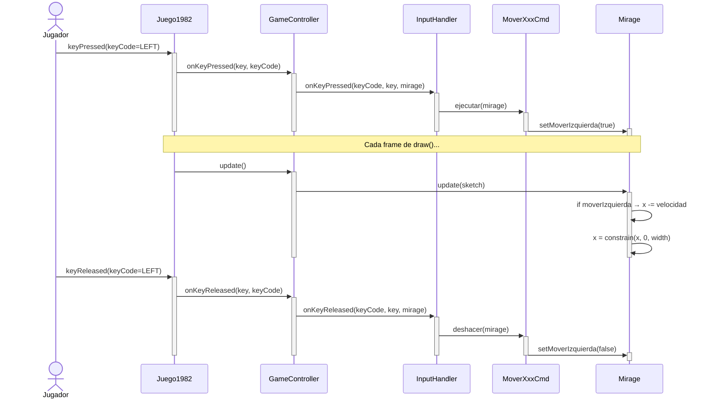

---

## UC-02: Disparar misil

**Actor:** Jugador  
**Precondición:** Estado = JUGANDO, Mirage vivo, cooldownActual == 0  
**Postcondición:** 1 o 2 `Proyectil` agregados a la lista de proyectiles activos

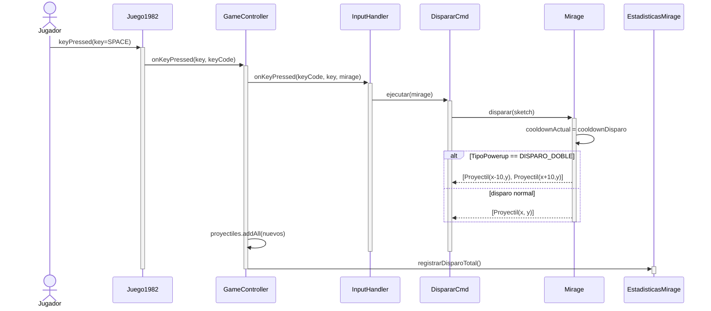

---

## UC-03: Proyectil destruye enemigo

**Actor:** Sistema  
**Precondición:** Proyectil activo y Enemigo activo en pantalla  
**Postcondición:** Enemigo destruido, puntos sumados, disparo registrado como acertado

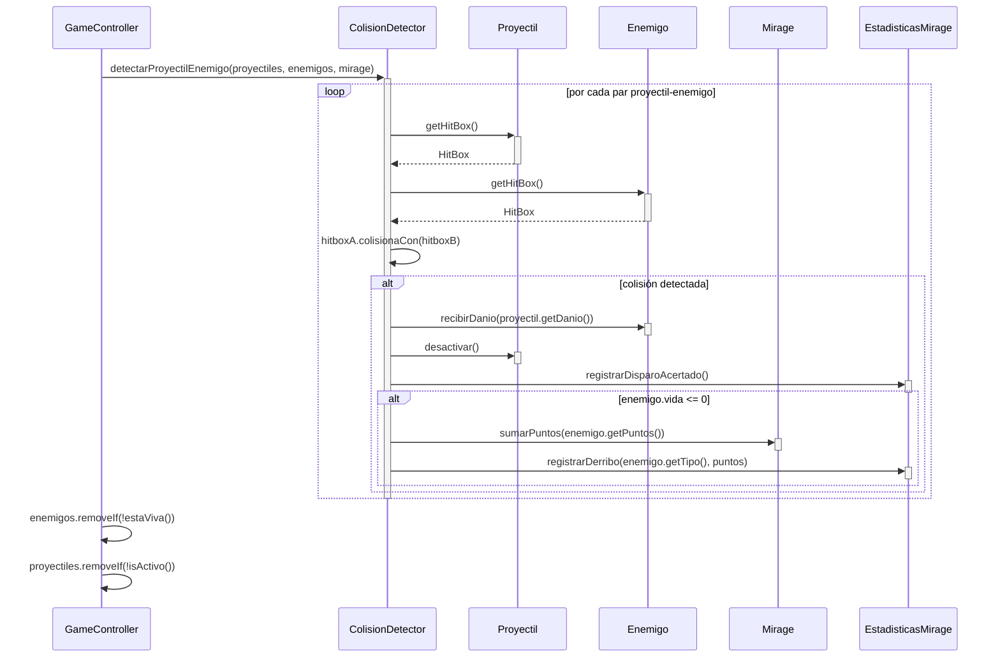

---

## UC-04: Enemigo impacta al Mirage

**Actor:** Sistema  
**Precondición:** Enemigo activo colisiona con la HitBox del Mirage, Mirage no invencible  
**Postcondición:** Mirage pierde una vida y entra en estado invencible

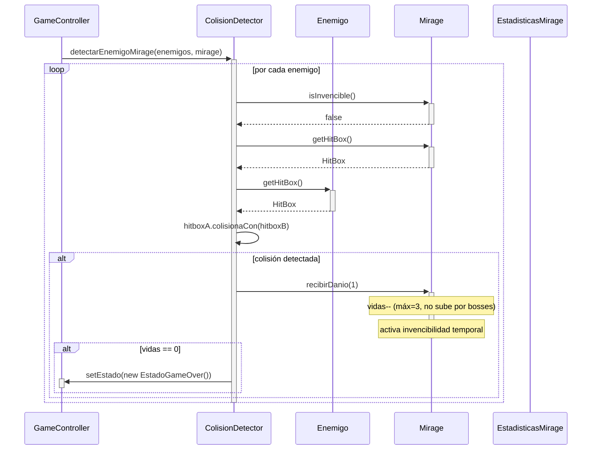

---

## UC-05: Fin de partida (Game Over)

**Actor:** Sistema  
**Precondición:** Mirage sin vidas  
**Postcondición:** Estadísticas exportadas al HOME, pantalla Game Over visible

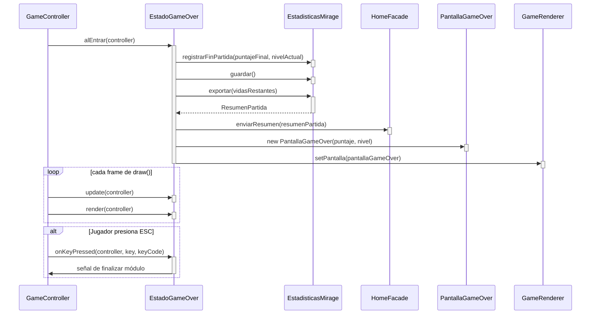

---

## UC-06: Pausar el juego

**Actor:** Jugador  
**Precondición:** Estado = JUGANDO  
**Postcondición:** Estado = PAUSADO (la lógica de juego se congela)

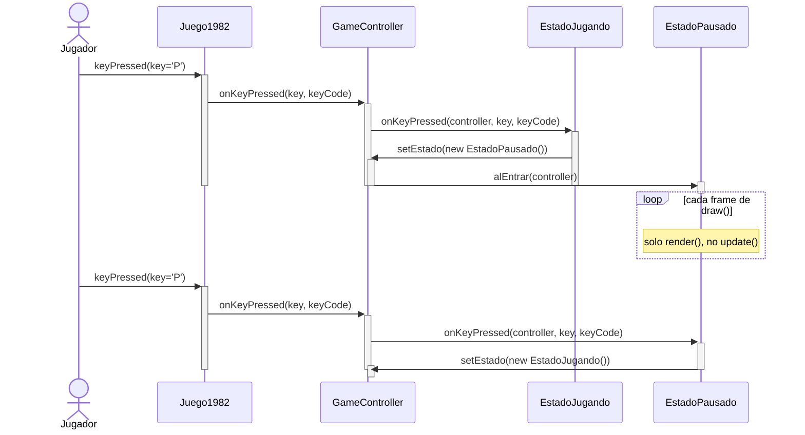

---

## UC-07: Nivel completado (4 bosses vencidos)

**Actor:** Sistema  
**Precondición:** `jefesVencidos == 4` en `NivelMirage`  
**Postcondición:** Dificultad escalada, nuevo nivel iniciado, HOME notificado

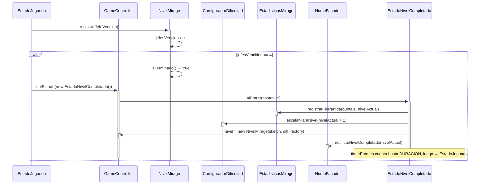

---

## UC-08: Oleada de enemigos se activa

**Actor:** Sistema  
**Precondición:** Estado = JUGANDO, `enFaseBoss == false`  
**Postcondición:** Batch de enemigos normales agregados a la lista activa

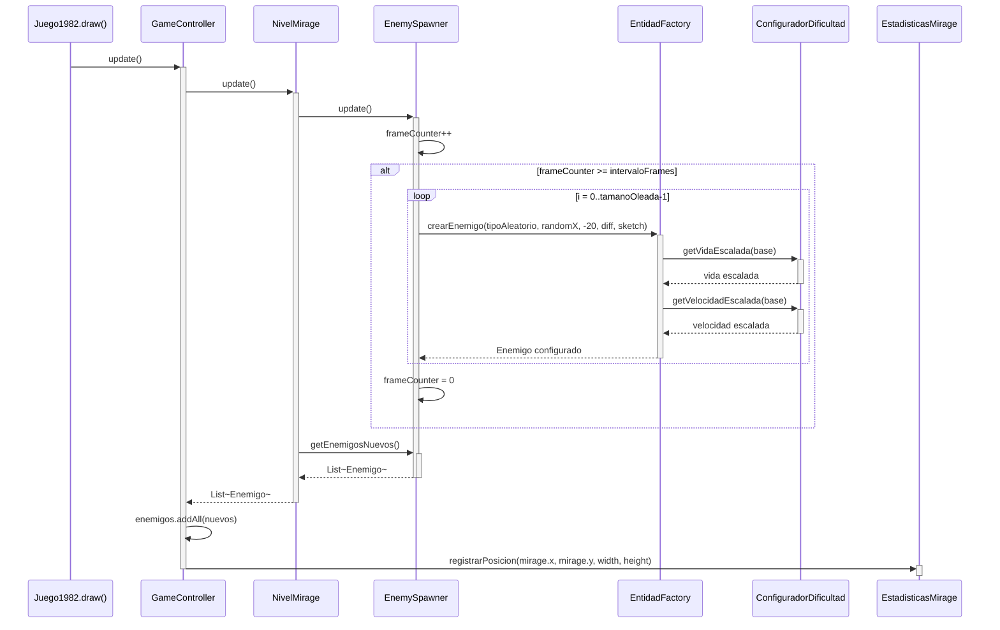

---

## UC-10: JefeBarco lanza kamikazes

**Actor:** Sistema  
**Precondición:** `jefeActual` es `JefeBarco`, `timerAtaque >= intervaloAtaque`  
**Postcondición:** N `EnemigoKamikaze` apuntando al Mirage agregados a la lista

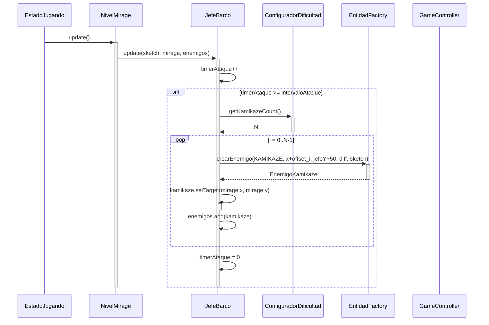

---

## UC-14: Recoger powerup

**Actor:** Jugador / Sistema  
**Precondición:** `puntuacion >= proximoUmbral`, Powerup cayendo en pantalla  
**Postcondición:** Efecto del powerup aplicado a Mirage por `DURACION_FRAMES`

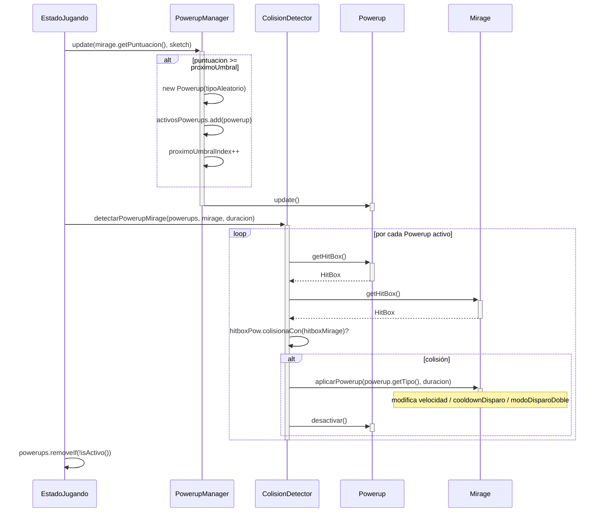

---

## UC-20: Kamikaze carga contra el Mirage

**Actor:** Sistema  
**Precondición:** `EnemigoKamikaze` activo, `mirage.getY() > umbralY`  
**Postcondición:** Kamikaze se lanza en línea recta hacia la última posición del Mirage

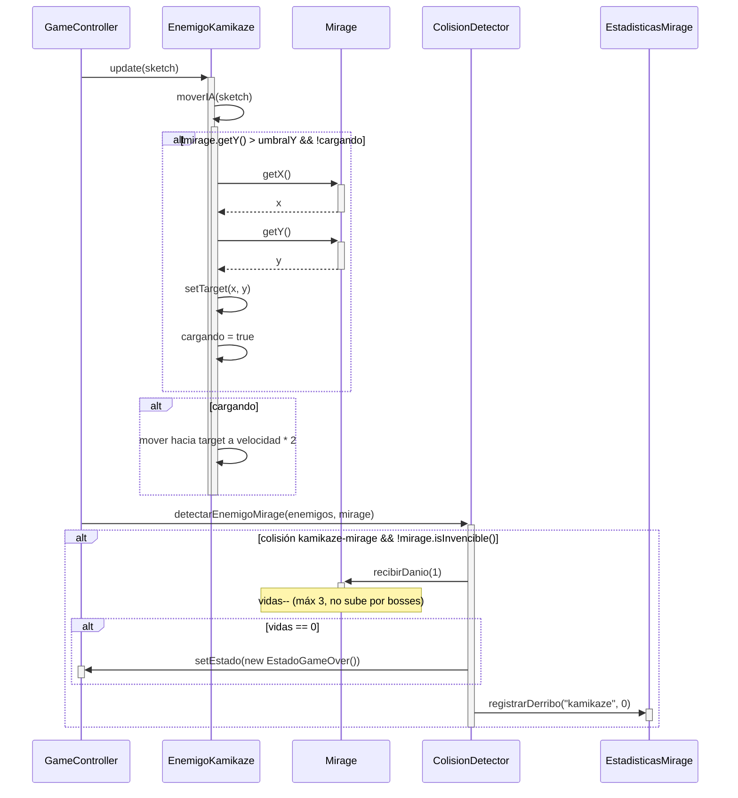