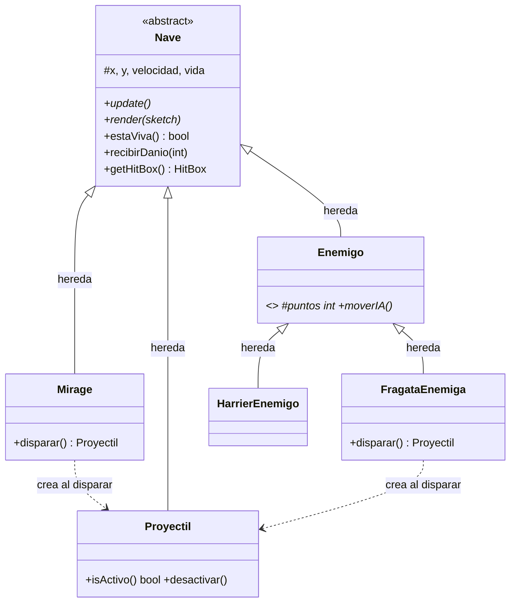
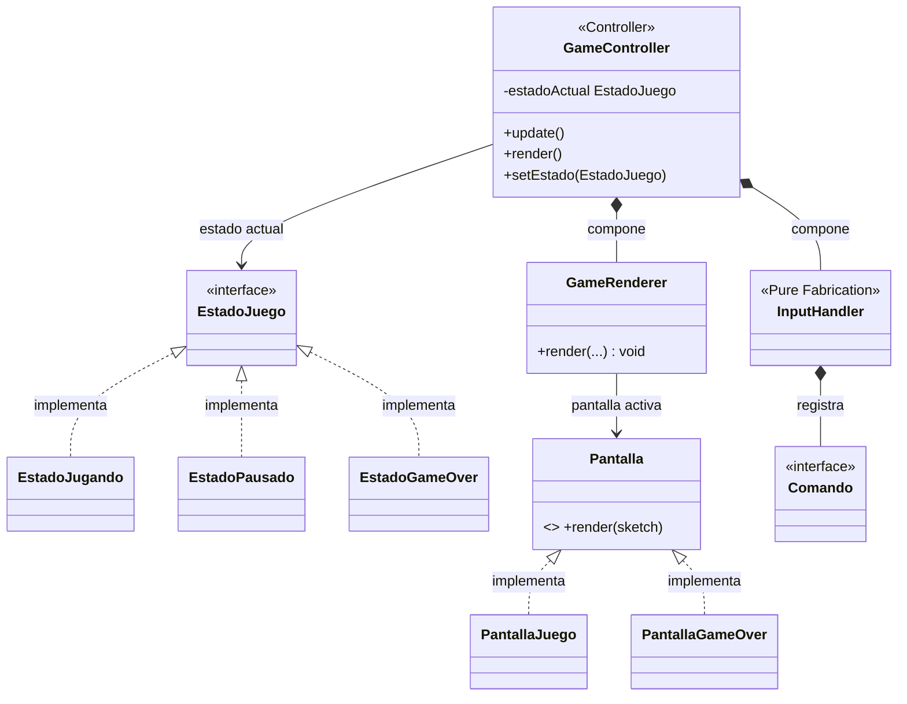

# Diagrama de Clases — Módulo Mirage

> TPI Algoritmos 1 · 2026 1° Cuatrimestre  
> Vista estática del sistema — cubre p5, p6 y p7 del TPI

---

## Diagrama completo del módulo

**Leyenda de relaciones:** `<|--` herencia, `<|..` implementación,
`*--` composición, `o--` agregación, `-->` asociación y `..>` dependencia/uso.

```mermaid
classDiagram
    %% ── EXTERNOS / FRONTERA ────────────────────────────────
    class HOME {
        <<external>>
        +iniciarModulo() void
        +updateModulo() void
        +renderModulo() void
        +enviarInput(key, keyCode) void
        +recibirResumen(resumen) void
    }

    %% ── FACADE ─────────────────────────────────────────────
    class MirageModulo {
        <<Facade>>
        -controller GameController
        +iniciar(sketch) void
        +pausar() void
        +reanudar() void
        +update() void
        +render() void
        +onKeyPressed(key, keyCode) void
        +onKeyReleased(key, keyCode) void
        +getResumen() ResumenPartida
    }

    %% ── CONTROLLER ──────────────────────────────────────────
    class GameController {
        <<Controller>>
        -sketch PApplet
        -estadoActual EstadoJuego
        -mirage Mirage
        -enemigos List~Enemigo~
        -proyectiles List~Proyectil~
        -nivel NivelMirage
        -colisionDetector ColisionDetector
        -renderer GameRenderer
        -inputHandler InputHandler
        +init() void
        +update() void
        +render() void
        +setEstado(EstadoJuego) void
        +onKeyPressed(keyCode) void
        +onKeyReleased(keyCode) void
        +agregarProyectil(proyectil) void
        +limpiarEntidadesInactivas() void
        +getMirage() Mirage
        +getEnemigos() List~Enemigo~
        +getProyectiles() List~Proyectil~
        +getNivel() NivelMirage
        +getColisionDetector() ColisionDetector
        +getEstadisticas() EstadisticasMirage
        +getRenderer() GameRenderer
        +getInputHandler() InputHandler
        +finalizarModulo() void
    }

    class InputHandler {
        <<Pure Fabrication>>
        -comandos Map~Integer, Comando~
        +onKeyPressed(keyCode, controller) void
        +onKeyReleased(keyCode, controller) void
        -registrarComandos() void
    }

    class Comando {
        <<interface>>
        +ejecutar(controller) void
        +deshacer(controller) void
    }
    class MoverIzquierdaCmd { +ejecutar(controller) void }
    class MoverDerechaCmd   { +ejecutar(controller) void }
    class MoverArribaCmd    { +ejecutar(controller) void }
    class MoverAbajoCmd     { +ejecutar(controller) void }
    class DispararCmd       { +ejecutar(controller) void }

    %% ── STATE ───────────────────────────────────────────────
    class EstadoJuego {
        <<interface>>
        +update(controller) void
        +render(controller) void
        +alEntrar(controller) void
        +onKeyPressed(controller, keyCode) void
    }
    class EstadoJugando  { +update(controller) +render(controller) +alEntrar(controller) +onKeyPressed(controller, keyCode) }
    class EstadoPausado  { +update(controller) +render(controller) +alEntrar(controller) +onKeyPressed(controller, keyCode) }
    class EstadoGameOver {
        -puntajeFinal int
        +EstadoGameOver()
        +update(controller) +render(controller) +alEntrar(controller) +onKeyPressed(controller, keyCode)
    }

    %% ── MODEL: ENTIDADES ────────────────────────────────────
    class Nave {
        <<abstract>>
        #x float
        #y float
        #velocidad float
        #vida int
        +update() void*
        +render(sketch) void*
        +getHitBox() HitBox
        +estaViva() bool
        +recibirDanio(danio) void
        +getX() float
        +getY() float
    }

    class Mirage {
        -vidas int
        -puntuacion int
        -invencible bool
        -frameInvencible int
        +update() void
        +render(sketch) void
        +disparar() Proyectil
        +sumarPuntos(puntos) void
        +setMoverIzquierda(valor) void
        +setMoverDerecha(valor) void
        +setMoverArriba(valor) void
        +setMoverAbajo(valor) void
        +getVidas() int
        +getPuntuacion() int
        +isInvencible() bool
    }

    class Proyectil {
        -activo bool
        -danio int
        +Proyectil(x, y, sketch)
        +update() void
        +render(sketch) void
        +isActivo() bool
        +desactivar() void
        +getDanio() int
        +getHitBox() HitBox
    }

    class Enemigo {
        <<abstract>>
        #puntos int
        +update() void
        +render(sketch) void*
        +getPuntos() int
        #moverIA() void*
    }

    class HarrierEnemigo {
        +render(sketch) void
        #moverIA() void
    }

    class FragataEnemiga {
        -framesSinDisparar int
        +render(sketch) void
        #moverIA() void
        +debeDisparar() bool
        +disparar() Proyectil
    }

    class EnemyFactory {
        <<Factory>>
        +crear(Tipo, sketch, x, y) Enemigo$
    }

    %% ── MODEL: FÍSICA ───────────────────────────────────────
    class HitBox {
        -x float
        -y float
        -ancho float
        -alto float
        +colisionaCon(HitBox) bool
        +moverA(x, y) void
    }

    class ColisionDetector {
        <<Pure Fabrication>>
        -estadisticas EstadisticasMirage
        +detectarProyectilEnemigo(proyectiles, enemigos, mirage) void
        +detectarEnemigoMirage(enemigos, mirage) void
    }

    %% ── MODEL: NIVELES ──────────────────────────────────────
    class Nivel {
        <<abstract>>
        +update() void*
        +isTerminado() bool*
        +getEnemigosNuevos() List~Enemigo~*
    }

    class NivelMirage {
        -spawner EnemySpawner
        -oleadaActual int
        +update() void
        +isTerminado() bool
        +getEnemigosNuevos() List~Enemigo~
    }

    class EnemySpawner {
        <<Pure Fabrication>>
        -intervaloFrames int
        -frameCounter int
        +update() void
        +getEnemigosNuevos() List~Enemigo~
    }

    %% ── MODEL: STATS ────────────────────────────────────────
    class EstadisticasMirage {
        -enemigosDerribados int
        -tiempoJugado float
        -puntajeMaximo int
        -partidasJugadas int
        +registrarDerribo(puntos) void
        +registrarFinPartida(puntaje) void
        +guardar() void
        +cargar() void
        +exportar() ResumenPartida
    }

    class ResumenPartida {
        <<DTO>>
        -puntajeFinal int
        -enemigosDerribados int
        -vidasRestantes int
        -duracionSegundos float
        +getPuntajeFinal() int
        +getEnemigosDerribados() int
        +getVidasRestantes() int
        +getDuracionSegundos() float
        +getModuloNombre() String
    }

    %% ── VIEW ────────────────────────────────────────────────
    class GameRenderer {
        -pantallaActual Pantalla
        -spriteLoader SpriteLoader
        +render(mirage, enemigos, proyectiles, sketch) void
        +setPantalla(Pantalla) void
    }

    class Pantalla {
        <<interface>>
        +render(sketch) void
        +update() void
    }
    class PantallaJuego   { +render(sketch) void +update() void }
    class PantallaGameOver {
        -puntaje int
        +PantallaGameOver(puntaje, enemigosDerribados)
        +render(sketch) void
        +update() void
    }

    class SpriteLoader {
        <<Pure Fabrication>>
        -cache Map~String, PImage~
        +cargar(nombre, sketch) void$
        +get(nombre) PImage$
    }

    class Animacion {
        -frames List~PImage~
        -frameActual int
        -velocidad int
        +update() void
        +getFrameActual() PImage
    }

    %% ── EXCEPCIONES ─────────────────────────────────────────
    class JuegoException      { <<Exception>> }
    class ColisionException   { <<Exception>> }
    class RecursoNoEncontradoException { <<Exception>> }

    %% ── RELACIONES ──────────────────────────────────────────
    HOME --> MirageModulo : ejecuta módulo
    MirageModulo *-- GameController : compone
    MirageModulo ..> ResumenPartida : retorna DTO

    GameController --> EstadoJuego : estado actual
    GameController *-- Mirage : compone jugador
    GameController *-- GameRenderer : compone vista
    GameController *-- InputHandler : compone input
    GameController *-- NivelMirage : compone nivel
    GameController *-- ColisionDetector : compone servicio
    GameController *-- EstadisticasMirage : compone stats
    GameController o-- Enemigo : agrega enemigos activos
    GameController o-- Proyectil : agrega proyectiles activos
    GameController ..> PantallaGameOver : crea pantalla cierre

    InputHandler *-- Comando : registra comandos
    InputHandler ..> GameController : ejecuta sobre contexto
    Comando <|.. MoverIzquierdaCmd : implementa
    Comando <|.. MoverDerechaCmd : implementa
    Comando <|.. MoverArribaCmd : implementa
    Comando <|.. MoverAbajoCmd : implementa
    Comando <|.. DispararCmd : implementa

    EstadoJuego <|.. EstadoJugando : implementa
    EstadoJuego <|.. EstadoPausado : implementa
    EstadoJuego <|.. EstadoGameOver : implementa
    EstadoJuego ..> GameController : recibe contexto

    Nave <|-- Mirage : hereda
    Nave <|-- Enemigo : hereda
    Nave <|-- Proyectil : hereda
    Nave ..> HitBox : crea/retorna
    Mirage ..> Proyectil : crea al disparar

    Enemigo <|-- HarrierEnemigo : hereda
    Enemigo <|-- FragataEnemiga : hereda
    FragataEnemiga ..> Proyectil : crea al disparar
    EnemyFactory ..> Enemigo : crea

    Nivel <|-- NivelMirage : hereda
    NivelMirage *-- EnemySpawner : compone
    EnemySpawner ..> EnemyFactory : usa factory

    ColisionDetector ..> HitBox : consulta
    ColisionDetector --> EstadisticasMirage : registra eventos
    ColisionDetector ..> ColisionException : puede lanzar

    GameRenderer --> Pantalla : pantalla activa
    GameRenderer --> SpriteLoader : usa recursos
    Pantalla <|.. PantallaJuego : implementa
    Pantalla <|.. PantallaGameOver : implementa
    Animacion ..> SpriteLoader : obtiene frames

    EstadisticasMirage ..> ResumenPartida : exporta
    SpriteLoader ..> RecursoNoEncontradoException : puede lanzar
    MirageModulo ..> JuegoException : propaga errores del módulo
    GameController ..> JuegoException : reclasifica errores

    JuegoException <|-- ColisionException : hereda
    JuegoException <|-- RecursoNoEncontradoException : hereda
```

---

## Vista p6 — Model (entidades y jerarquía)

---

## Vista p7 — Vista y Controlador

