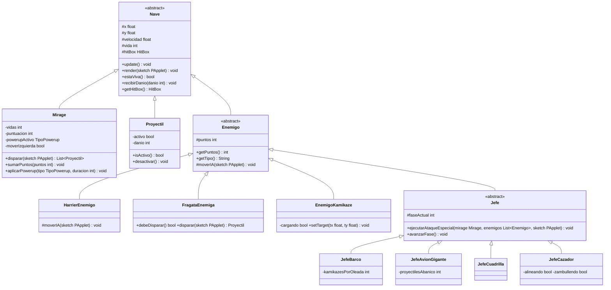
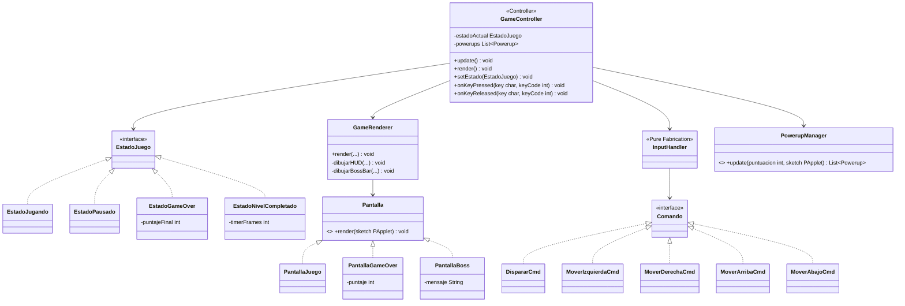

# Diagrama de Clases — Módulo Mirage

> TPI Algoritmos 1 · 2026 1° Cuatrimestre  
> Vista estática del sistema — cubre p5, p6 y p7 del TPI

---

## Diagrama completo del módulo

```mermaid
classDiagram
    direction TB

    %% ── FACADE + INTEGRACIÓN CON HOME ──────────────────────
    class MirageModulo {
        <<Facade>>
        -controller GameController
        -homeFacade HomeFacade
        +iniciar(sketch PApplet) void
        +pausar() void
        +reanudar() void
        +update() void
        +render() void
        +onKeyPressed(key char, keyCode int) void
        +onKeyReleased(key char, keyCode int) void
        +getResumen() ResumenPartida
    }

    class HomeFacade {
        <<interface>>
        +enviarResumen(resumen ResumenPartida) void
        +notificarNivelCompletado(nivel int) void
    }

    %% ── CONTROLLER ──────────────────────────────────────────
    class GameController {
        <<Controller>>
        -sketch PApplet
        -estadoActual EstadoJuego
        -mirage Mirage
        -enemigos List~Enemigo~
        -powerups List~Powerup~
        -nivel NivelMirage
        -colisionDetector ColisionDetector
        -estadisticas EstadisticasMirage
        -renderer GameRenderer
        -inputHandler InputHandler
        -powerupManager PowerupManager
        +init() void
        +update() void
        +render() void
        +setEstado(estado EstadoJuego) void
        +onKeyPressed(key char, keyCode int) void
        +onKeyReleased(key char, keyCode int) void
    }

    class InputHandler {
        <<Pure Fabrication>>
        -comandosPorKeyCode Map~Integer,Comando~
        +onKeyPressed(keyCode int, key char, mirage Mirage) void
        +onKeyReleased(keyCode int, key char, mirage Mirage) void
    }

    class Comando {
        <<interface>>
        +ejecutar(mirage Mirage) void
        +deshacer(mirage Mirage) void
    }

    class MoverIzquierdaCmd { +ejecutar(mirage Mirage) void +deshacer(mirage Mirage) void }
    class MoverDerechaCmd   { +ejecutar(mirage Mirage) void +deshacer(mirage Mirage) void }
    class MoverArribaCmd    { +ejecutar(mirage Mirage) void +deshacer(mirage Mirage) void }
    class MoverAbajoCmd     { +ejecutar(mirage Mirage) void +deshacer(mirage Mirage) void }

    class DispararCmd {
        -sketch PApplet
        +DispararCmd(sketch PApplet)
        +ejecutar(mirage Mirage) void
        +deshacer(mirage Mirage) void
    }

    %% ── STATE ───────────────────────────────────────────────
    class EstadoJuego {
        <<interface>>
        +update(ctrl GameController) void
        +render(ctrl GameController) void
        +alEntrar(ctrl GameController) void
        +onKeyPressed(ctrl GameController, key char, keyCode int) void
    }

    class EstadoJugando         { +update() +render() +alEntrar() +onKeyPressed() }
    class EstadoPausado         { +update() +render() +alEntrar() +onKeyPressed() }
    class EstadoGameOver        { -puntajeFinal int +update() +render() +alEntrar() +onKeyPressed() }
    class EstadoNivelCompletado { -timerFrames int -DURACION int +update() +render() +alEntrar() +onKeyPressed() }

    %% ── MODEL: ENTIDADES BASE ───────────────────────────────
    class Nave {
        <<abstract>>
        #x float
        #y float
        #velocidad float
        #vida int
        #hitBox HitBox
        +update() void
        +render(sketch PApplet) void
        +recibirDanio(danio int) void
        +estaViva() bool
        +getX() float
        +getY() float
        +getHitBox() HitBox
    }

    class Mirage {
        -vidas int
        -puntuacion int
        -invencible bool
        -frameInvencible int
        -DURACION_INVENCIBILIDAD int
        -VIDAS_MAX int
        -cooldownDisparo int
        -cooldownActual int
        -moverIzquierda bool
        -moverDerecha bool
        -moverArriba bool
        -moverAbajo bool
        -proyectiles List~Proyectil~
        -disparosTotales int
        -powerupActivo TipoPowerup
        -framesPowerupRestantes int
        +update(sketch PApplet) void
        +render(sketch PApplet) void
        +disparar(sketch PApplet) void
        +sumarPuntos(puntos int) void
        +aplicarPowerup(tipo TipoPowerup, duracion int) void
        +setMoverIzquierda(v bool) void
        +setMoverDerecha(v bool) void
        +setMoverArriba(v bool) void
        +setMoverAbajo(v bool) void
        +getVidas() int
        +getPuntuacion() int
        +getProyectiles() List~Proyectil~
        +getDisparosTotales() int
        +isInvencible() bool
        +getPowerupActivo() TipoPowerup
    }

    class Proyectil {
        -activo bool
        -danio int
        -velocidadY float
        +update() void
        +render(sketch PApplet) void
        +desactivar() void
        +isActivo() bool
        +getDanio() int
    }

    %% ── MODEL: ENEMIGOS (Template Method en moverIA) ────────
    class Enemigo {
        <<abstract>>
        #puntos int
        #velocidadX float
        +update(sketch PApplet) void
        +render(sketch PApplet) void
        #moverIA(sketch PApplet) void
        +getPuntos() int
        +getTipo() String
    }

    class HarrierEnemigo {
        #moverIA(sketch PApplet) void
        +render(sketch PApplet) void
    }

    class FragataEnemiga {
        -cooldownDisparo int
        -cooldownActual int
        #moverIA(sketch PApplet) void
        +render(sketch PApplet) void
        +debeDisparar() bool
        +disparar(sketch PApplet) Proyectil
    }

    class EnemigoKamikaze {
        -umbralY float
        -cargando bool
        -targetX float
        -targetY float
        +setTarget(tx float, ty float) void
        #moverIA(sketch PApplet) void
        +render(sketch PApplet) void
    }

    %% ── MODEL: JEFES ────────────────────────────────────────
    class Jefe {
        <<abstract>>
        #faseActual int
        #maxFases int
        #timerAtaque int
        #intervaloAtaque int
        +update(sketch PApplet, mirage Mirage, enemigos List~Enemigo~) void
        +render(sketch PApplet) void
        #moverIA(sketch PApplet) void
        +ejecutarAtaqueEspecial(mirage Mirage, enemigos List~Enemigo~, sketch PApplet) void
        +avanzarFase() void
        +getFaseActual() int
    }

    class JefeBarco {
        -kamikazesPorOleada int
        #moverIA(sketch PApplet) void
        +ejecutarAtaqueEspecial(mirage Mirage, enemigos List~Enemigo~, sketch PApplet) void
        +render(sketch PApplet) void
    }

    class JefeAvionGigante {
        -proyectilesAbanico int
        #moverIA(sketch PApplet) void
        +ejecutarAtaqueEspecial(mirage Mirage, enemigos List~Enemigo~, sketch PApplet) void
        +render(sketch PApplet) void
    }

    class JefeCuadrilla {
        #moverIA(sketch PApplet) void
        +ejecutarAtaqueEspecial(mirage Mirage, enemigos List~Enemigo~, sketch PApplet) void
        +render(sketch PApplet) void
    }

    class JefeCazador {
        -alineando bool
        -zambullendo bool
        #moverIA(sketch PApplet) void
        +ejecutarAtaqueEspecial(mirage Mirage, enemigos List~Enemigo~, sketch PApplet) void
        +render(sketch PApplet) void
    }

    %% ── FACTORY ─────────────────────────────────────────────
    class EntidadFactory {
        <<Factory>>
        +crearEnemigo(tipo TipoEnemigo, x float, y float, diff ConfiguradorDificultad, sketch PApplet) Enemigo$
        +crearJefe(tipo TipoJefe, diff ConfiguradorDificultad, sketch PApplet) Jefe$
    }

    class TipoEnemigo {
        <<enumeration>>
        HARRIER
        FRAGATA
        KAMIKAZE
    }

    class TipoJefe {
        <<enumeration>>
        BARCO
        AVION_GIGANTE
        CUADRILLA
        CAZADOR
    }

    %% ── POWERUP ─────────────────────────────────────────────
    class TipoPowerup {
        <<enumeration>>
        NINGUNO
        VELOCIDAD_MOVIMIENTO
        VELOCIDAD_DISPARO
        DISPARO_DOBLE
    }

    class Powerup {
        -x float
        -y float
        -tipo TipoPowerup
        -activo bool
        +update() void
        +render(sketch PApplet) void
        +getHitBox() HitBox
        +getTipo() TipoPowerup
        +isActivo() bool
        +desactivar() void
    }

    class PowerupManager {
        <<Pure Fabrication>>
        -umbrales List~Integer~
        -proximoUmbralIndex int
        -DURACION_FRAMES int
        +update(puntuacion int, sketch PApplet) List~Powerup~
        +getDuracion() int
    }

    %% ── MODEL: FÍSICA ───────────────────────────────────────
    class HitBox {
        -x float
        -y float
        -ancho float
        -alto float
        +colisionaCon(otro HitBox) bool
        +moverA(x float, y float) void
        +getX() float
        +getY() float
        +getAncho() float
        +getAlto() float
    }

    class ColisionDetector {
        <<Pure Fabrication>>
        -estadisticas EstadisticasMirage
        +detectarProyectilEnemigo(proyectiles List~Proyectil~, enemigos List~Enemigo~, mirage Mirage) void
        +detectarEnemigoMirage(enemigos List~Enemigo~, mirage Mirage) void
        +detectarPowerupMirage(powerups List~Powerup~, mirage Mirage, duracion int) void
    }

    %% ── MODEL: NIVELES ──────────────────────────────────────
    class Nivel {
        <<abstract>>
        +update() void
        +getEnemigosNuevos() List~Enemigo~
        +isTerminado() bool
    }

    class NivelMirage {
        -spawner EnemySpawner
        -secuenciaBosses List~TipoJefe~
        -indiceBossActual int
        -jefeActual Jefe
        -jefesVencidos int
        -enFaseBoss bool
        -diff ConfiguradorDificultad
        -factory EntidadFactory
        +update() void
        +getEnemigosNuevos() List~Enemigo~
        +getJefeActual() Jefe
        +registrarJefeVencido() void
        +isTerminado() bool
        +isEnFaseBoss() bool
    }

    class EnemySpawner {
        <<Pure Fabrication>>
        -sketch PApplet
        -frameCounter int
        -intervaloFrames int
        -tamanoOleada int
        -tipos List~TipoEnemigo~
        -diff ConfiguradorDificultad
        -factory EntidadFactory
        +update() void
        +getEnemigosNuevos() List~Enemigo~
        +setIntervalo(frames int) void
        +setTamanoOleada(n int) void
    }

    class ConfiguradorDificultad {
        <<Pure Fabrication>>
        -nivelActual int
        -multVida float
        -multVelocidad float
        -multCooldown float
        -multOleada float
        +escalarParaNivel(n int) void
        +getVidaEscalada(base int) int
        +getVelocidadEscalada(base float) float
        +getCooldownEscalado(base int) int
        +getTamanoOleada(base int) int
        +getKamikazeCount() int
    }

    %% ── MODEL: STATS ────────────────────────────────────────
    class EstadisticasMirage {
        -enemigosDerribados int
        -tiempoInicioMs long
        -puntajeMaximo int
        -disparosAcertados int
        -heatmap int[][]
        -enemigosPorTipo Map~String,Integer~
        -proyectilesDestruidos int
        -nivelMaximo int
        +registrarDisparoAcertado() void
        +registrarPosicion(x float, y float, w int, h int) void
        +registrarDerribo(tipo String, puntos int) void
        +registrarFinPartida(puntaje int, nivel int) void
        +exportar(vidasRestantes int, mirage Mirage) ResumenPartida
        +guardar() void
        +cargar() void
        +getPrecision() float
    }

    class ResumenPartida {
        <<DTO>>
        -puntajeFinal int
        -enemigosDerribados int
        -vidasRestantes int
        -duracionSegundos float
        -precision float
        -heatmap int[][]
        -enemigosPorTipo Map~String,Integer~
        -proyectilesDestruidos int
        -nivelAlcanzado int
        -moduloNombre String
        +getPuntajeFinal() int
        +getEnemigosDerribados() int
        +getVidasRestantes() int
        +getPrecision() float
        +getHeatmap() int[][]
        +getNivelAlcanzado() int
    }

    %% ── VIEW ────────────────────────────────────────────────
    class GameRenderer {
        -spriteLoader SpriteLoader
        -pantallaActual Pantalla
        +render(sketch PApplet, mirage Mirage, enemigos List~Enemigo~, proyectiles List~Proyectil~, powerups List~Powerup~, jefe Jefe) void
        +setPantalla(pantalla Pantalla) void
        -dibujarHUD(sketch PApplet, mirage Mirage, nivel int) void
        -dibujarBossBar(sketch PApplet, jefe Jefe) void
    }

    class Pantalla {
        <<interface>>
        +render(sketch PApplet) void
        +update() void
    }

    class PantallaJuego    { +render(sketch PApplet) void +update() void }
    class PantallaGameOver { -puntaje int -nivel int +render(sketch PApplet) void +update() void }
    class PantallaBoss     { -mensaje String +render(sketch PApplet) void +update() void }

    class SpriteLoader {
        <<Pure Fabrication>>
        -cache Map~String,PImage~
        +cargar(nombre String, sketch PApplet) void$
        +get(nombre String) PImage$
    }

    class Animacion {
        -nombresFrames List~String~
        -velocidad int
        -frameActual int
        -contador int
        +update() void
        +getFrame() PImage
        +reset() void
    }

    %% ── EXCEPCIONES ─────────────────────────────────────────
    class JuegoException               { <<Exception>> }
    class ColisionException            { <<Exception>> }
    class RecursoNoEncontradoException { <<Exception>> }

    %% ── RELACIONES ──────────────────────────────────────────
    MirageModulo --> GameController
    MirageModulo --> HomeFacade
    MirageModulo ..> ResumenPartida

    GameController --> EstadoJuego
    GameController --> Mirage
    GameController --> GameRenderer
    GameController --> InputHandler
    GameController --> NivelMirage
    GameController --> ColisionDetector
    GameController --> EstadisticasMirage
    GameController --> PowerupManager

    InputHandler --> Comando
    Comando <|.. MoverIzquierdaCmd
    Comando <|.. MoverDerechaCmd
    Comando <|.. MoverArribaCmd
    Comando <|.. MoverAbajoCmd
    Comando <|.. DispararCmd

    EstadoJuego <|.. EstadoJugando
    EstadoJuego <|.. EstadoPausado
    EstadoJuego <|.. EstadoGameOver
    EstadoJuego <|.. EstadoNivelCompletado

    Nave <|-- Mirage
    Nave <|-- Proyectil
    Nave <|-- Enemigo
    Nave --> HitBox
    Mirage o-- Proyectil

    Enemigo <|-- HarrierEnemigo
    Enemigo <|-- FragataEnemiga
    Enemigo <|-- EnemigoKamikaze
    Enemigo <|-- Jefe

    Jefe <|-- JefeBarco
    Jefe <|-- JefeAvionGigante
    Jefe <|-- JefeCuadrilla
    Jefe <|-- JefeCazador

    EntidadFactory ..> Enemigo
    EntidadFactory ..> Jefe
    EntidadFactory ..> ConfiguradorDificultad

    Powerup --> TipoPowerup
    PowerupManager ..> Powerup
    Mirage --> TipoPowerup

    Nivel <|-- NivelMirage
    NivelMirage --> EnemySpawner
    NivelMirage --> ConfiguradorDificultad
    NivelMirage --> EntidadFactory
    EnemySpawner --> EntidadFactory
    EnemySpawner --> ConfiguradorDificultad

    ColisionDetector --> HitBox
    ColisionDetector --> EstadisticasMirage

    EstadisticasMirage ..> ResumenPartida

    GameRenderer --> Pantalla
    GameRenderer --> SpriteLoader
    Pantalla <|.. PantallaJuego
    Pantalla <|.. PantallaGameOver
    Pantalla <|.. PantallaBoss
    Animacion --> SpriteLoader

    JuegoException <|-- ColisionException
    JuegoException <|-- RecursoNoEncontradoException
```

---

## Vista p6 — Model (entidades y jerarquía)

---

## Vista p7 — Vista y Controlador

---

## Decisiones de diseño

| Decisión | Elección | Justificación |
|----------|----------|---------------|
| Movimiento de enemigos | Template Method (`moverIA()` en cada subclase) | Evita jerarquía Strategy extra. Agregar tipo nuevo = 1 subclase, cero cambios al framework |
| Efectos de powerup | `TipoPowerup` enum + switch en `Mirage.aplicarPowerup()` | Evita interfaz + 3 implementaciones. Los efectos son simples |
| Factories | `EntidadFactory` unificada (2 métodos estáticos) | Una sola clase vs. EnemyFactory + BossFactory separadas |
| Vidas | `VIDAS_MAX = 3`, fijas | No se ganan vidas al matar bosses. Simplifica flujo |
| Processing keys | Flags booleanos en `Mirage` + `keyReleased` los baja | `keyPressed()` dispara con OS key-repeat; flags permiten movimiento suave en `draw()` |
| Bosses en lista enemigos | `Jefe extends Enemigo` | `ColisionDetector` los trata uniforme; `NivelMirage` tiene ref extra `jefeActual` para boss-bar |
| HomeFacade | Interfaz definida en nuestro módulo, HOME implementa | No importamos clases del HOME team. Inyección por constructor en `MirageModulo` |
| Colisiones filtradas | 3 métodos explícitos en `ColisionDetector` | Sin método enemigo↔enemigo → regla estructuralmente garantizada |