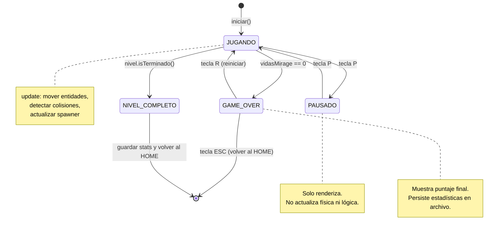
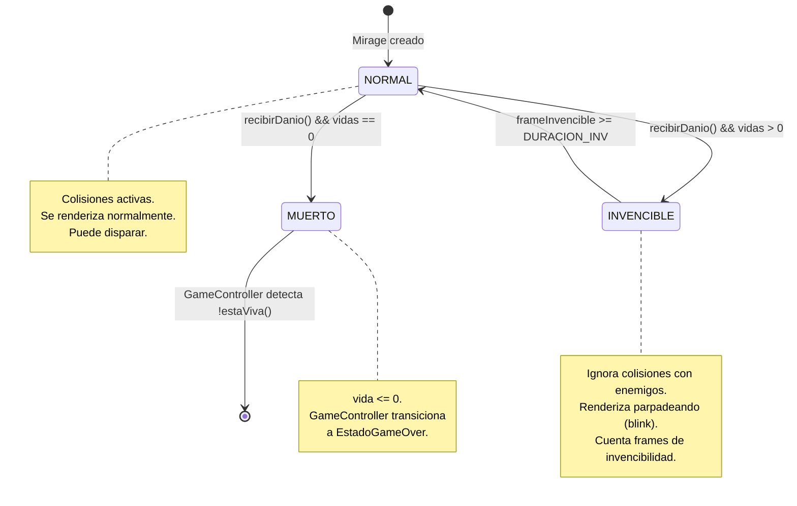
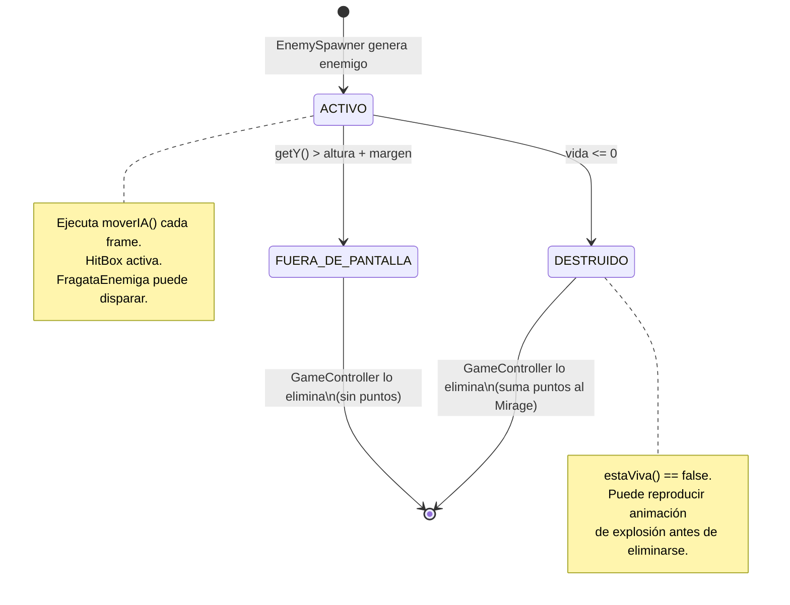
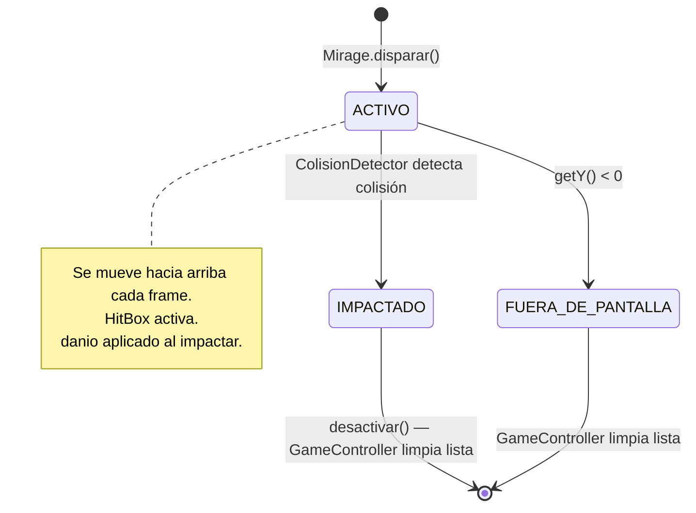

# Diagramas de Estado — Módulo Mirage

> TPI Algoritmos 1 · 2026 1° Cuatrimestre  
> Vista de comportamiento dinámico del sistema

---

## 1. Estado del Juego (máquina principal)

Gestiona el flujo de pantallas y controla qué se ejecuta en cada frame.
Implementado con el **patrón State** en `GameController`.

**Clases involucradas:**

| Estado | Clase Java |
|--------|-----------|
| JUGANDO | `EstadoJugando` |
| PAUSADO | `EstadoPausado` |
| GAME_OVER | `EstadoGameOver` |
| Transiciones | `GameController.setEstado(EstadoJuego)` |

---

## 2. Estado del Mirage (jugador)

Después de recibir daño, el Mirage entra en **invencibilidad temporal**
para evitar pérdidas de vida en cadena.

**Implementación sugerida en `Mirage.java`:**
- Campo `boolean invencible`
- Campo `int frameInvencible`
- Constante `int DURACION_INVENCIBILIDAD` (ej: 120 frames = 2 segundos)

---

## 3. Estado de un Enemigo

Cada enemigo tiene su propio ciclo de vida gestionado por `GameController`.

---

## 4. Estado de un Proyectil

Los proyectiles los crea `Mirage.disparar()` y los gestiona `GameController`.

---

## Resumen: quién gestiona cada estado

| Ciclo de vida | Gestionado por |
|---------------|---------------|
| Estado del juego (JUGANDO/PAUSADO/GAME_OVER) | `GameController` con patrón **State** |
| Estado del Mirage (NORMAL/INVENCIBLE/MUERTO) | Campo interno en `Mirage.update()` |
| Estado del Enemigo (ACTIVO/DESTRUIDO) | `estaViva()` + `GameController` limpia la lista |
| Estado del Proyectil (ACTIVO/IMPACTADO) | `isActivo()` + `GameController` limpia la lista |
