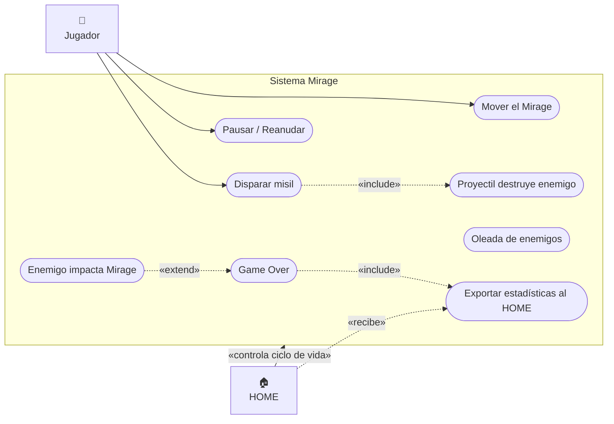
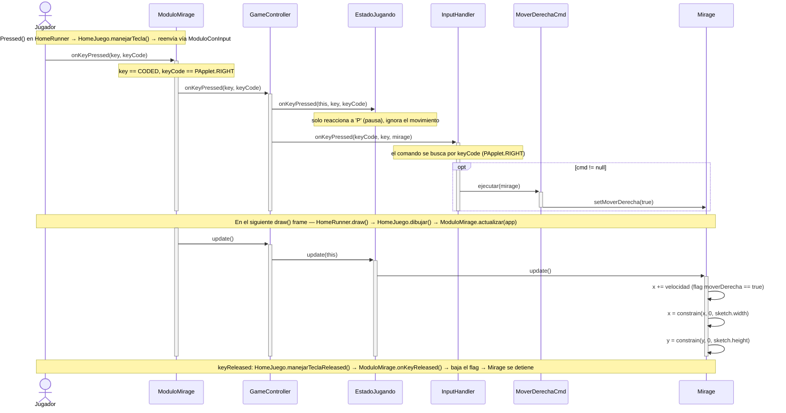
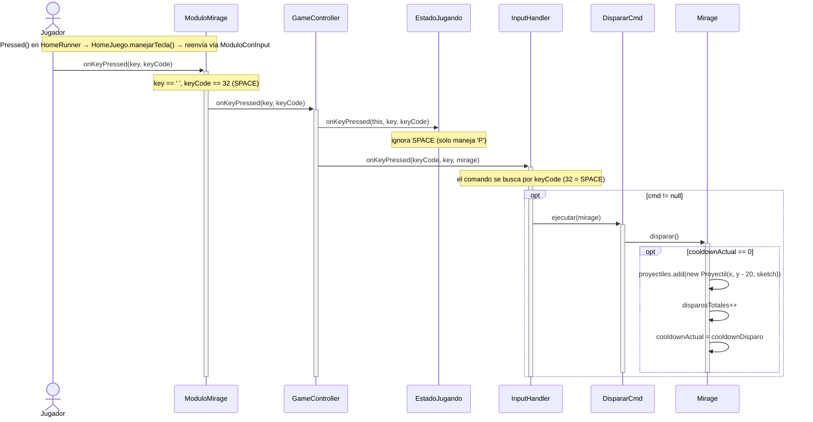
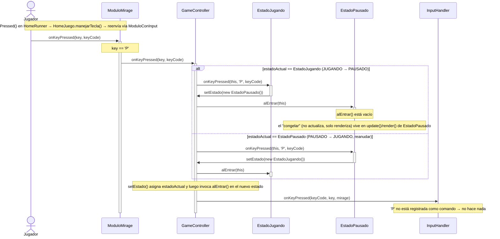
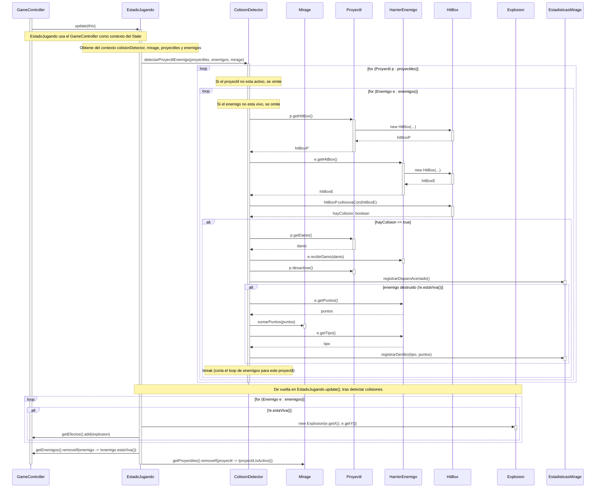
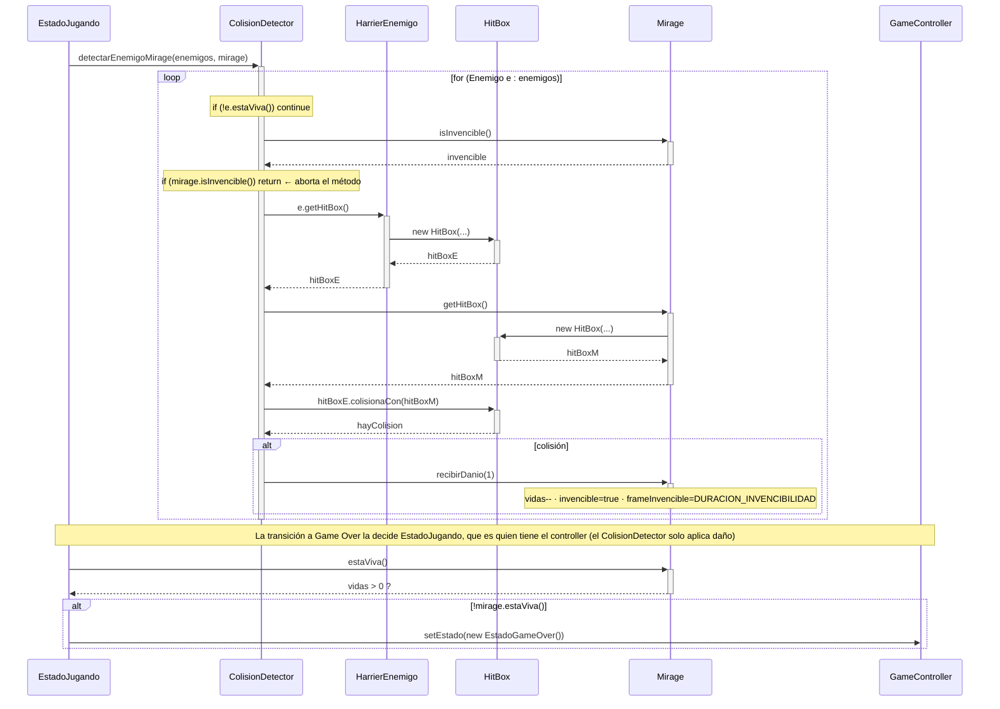
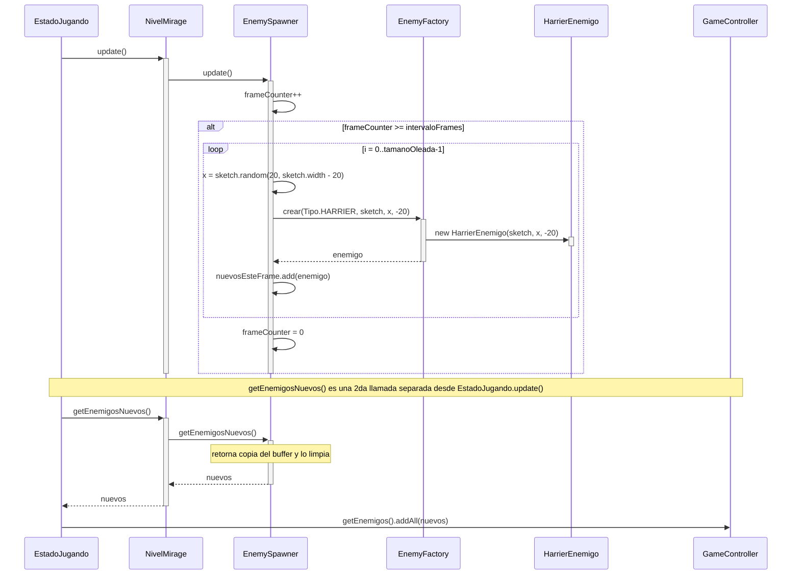
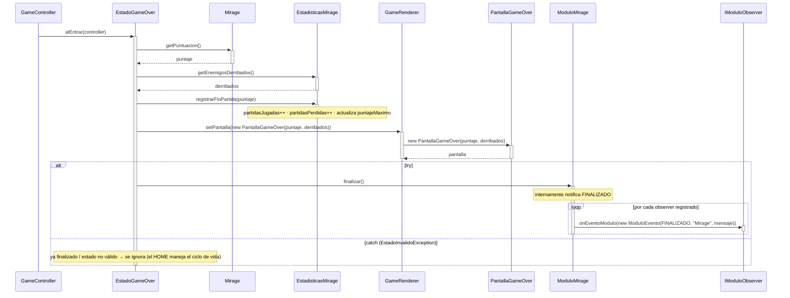
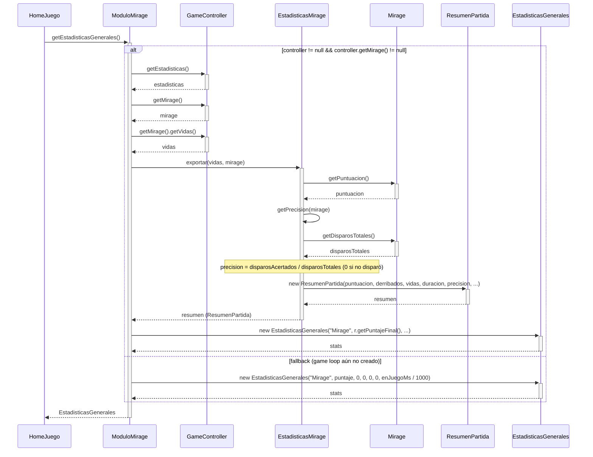

# Casos de Uso — MVP 1

> TPI Algoritmos 1 · 2026 1° Cuatrimestre  
> Módulo Mirage — primera versión entregable

---

## Diagrama de casos de uso

---

## Tabla de casos de uso

| ID | Nombre | Actor | Clases involucradas |
|----|--------|-------|---------------------|
| UC-01 | Mover el Mirage | Jugador | `HomeRunner`, `HomeJuego`, `ModuloMirage`, `GameController`, `EstadoJugando`, `InputHandler`, `MoverDerechaCmd`, `Mirage` |
| UC-02 | Disparar misil | Jugador | `HomeRunner`, `HomeJuego`, `ModuloMirage`, `GameController`, `InputHandler`, `DispararCmd`, `Mirage`, `Proyectil` |
| UC-03 | Pausar / Reanudar | Jugador | `HomeRunner`, `HomeJuego`, `ModuloMirage`, `GameController`, `EstadoJugando`, `EstadoPausado` |
| UC-04 | Proyectil destruye enemigo | Sistema | `EstadoJugando`, `GameController`, `ColisionDetector`, `Mirage`, `Proyectil`, `HarrierEnemigo`, `HitBox`, `Explosion`, `EstadisticasMirage` |
| UC-05 | Enemigo impacta al Mirage | Sistema | `EstadoJugando`, `ColisionDetector`, `HarrierEnemigo`, `HitBox`, `Mirage`, `GameController`, `EstadoGameOver` |
| UC-06 | Oleada de enemigos se activa | Sistema | `EstadoJugando`, `NivelMirage`, `EnemySpawner`, `EnemyFactory`, `HarrierEnemigo`, `GameController` |
| UC-07 | Game Over | Sistema | `GameController`, `EstadoGameOver`, `EstadisticasMirage`, `GameRenderer`, `PantallaGameOver`, `ModuloMirage`, `IModuloObserver` |
| UC-08 | Exportar estadísticas al HOME | Sistema / HOME | `HomeJuego`, `ModuloMirage`, `GameController`, `EstadisticasMirage`, `Mirage`, `ResumenPartida`, `EstadisticasGenerales` |

---

## UC-01: Mover el Mirage

**Actor:** Jugador  
**Precondición:** Estado = JUGANDO, Mirage vivo  
**Postcondición:** posición del Mirage actualizada en el siguiente frame

---

## UC-02: Disparar misil

**Actor:** Jugador  
**Precondición:** Estado = JUGANDO, `cooldownActual == 0`  
**Postcondición:** 1 `Proyectil` agregado a `mirage.proyectiles`

---

## UC-03: Pausar / Reanudar

**Actor:** Jugador  
**Precondición:** Estado = JUGANDO o PAUSADO  
**Postcondición:** estado cambia entre JUGANDO y PAUSADO

---

## UC-04: Proyectil destruye enemigo

**Actor:** Sistema  
**Precondición:** `Proyectil` activo y `HarrierEnemigo` activo en pantalla  
**Postcondición:** enemigo destruido, puntos sumados, disparo acertado registrado

---

## UC-05: Enemigo impacta al Mirage

**Actor:** Sistema  
**Precondición:** `HarrierEnemigo` activo, `Mirage` no invencible  
**Postcondición:** Mirage pierde 1 vida, entra en invencibilidad temporal

---

## UC-06: Oleada de enemigos se activa

**Actor:** Sistema  
**Precondición:** `frameCounter >= intervaloFrames`  
**Postcondición:** N `HarrierEnemigo` spawnean en pantalla

---

## UC-07: Game Over

**Actor:** Sistema  
**Precondición:** `mirage.getVidas() == 0`  
**Postcondición:** Estado = GAME_OVER, HOME notificado con evento FINALIZADO

---

## UC-08: Exportar estadísticas al HOME

**Actor:** Sistema / HOME  
**Precondición:** partida finalizada (Estado = GAME_OVER)  
**Postcondición:** `EstadisticasGenerales` disponible para el HOME

