```mermaid
classDiagram
    direction TB

    %% ── INTERFACES / DTOs HOME (externas — definidas por el HOME team) ──
    class ModuloJuego {
        <<interface - HOME>>
        +getNombreModulo() String
        +getDescripcion() String
        +getNombreAvion() String
        +inicializarContexto(ctx ContextoJuego) void
        +iniciar() void
        +pausar() void
        +reanudar() void
        +finalizar() void
        +getEstado() EstadoJuego
        +getEstadisticasGenerales() EstadisticasGenerales
        +agregarObserver(observer IModuloObserver) void
        +removerObserver(observer IModuloObserver) void
        +actualizar(app PApplet) void
        +dibujar(app PApplet) void
        +reset() void
    }

    class ModuloConInput {
        <<interface - HOME>>
        +onKeyPressed(key char, keyCode int) void
        +onKeyReleased(key char, keyCode int) void
    }

    class IModuloObserver {
        <<interface - HOME>>
        +onEventoModulo(evento ModuloEvento) void
    }

    class EstadisticasGenerales {
        <<DTO - HOME>>
        -nombreModulo String
        -puntajeTotal int
        -partidasJugadas int
        -partidasGanadas int
        -partidasPerdidas int
        -enemigosDestruidos int
        -tiempoJugadoSegundos long
    }

    class ModuloEvento {
        <<DTO - HOME>>
        -tipo Tipo
        -nombreModulo String
        -mensaje String
    }

    %% NOTA: iniciar/pausar/reanudar/finalizar de ModuloJuego declaran
    %% throws EstadoInvalidoException (omitido en el diagrama por brevedad).

    %% ── FACADE ───────────────────────────────────────────────────
    class ModuloMirage {
        <<Facade - implements ModuloJuego, ModuloConInput>>
        -estadoActual EstadoJuego
        -observers List~IModuloObserver~
        -contexto ContextoJuego
        -controller GameController
        -puntaje int
        +getNombreModulo() String
        +getDescripcion() String
        +getNombreAvion() String
        +inicializarContexto(ctx ContextoJuego) void
        +iniciar() void
        +pausar() void
        +reanudar() void
        +finalizar() void
        +actualizar(app PApplet) void
        +dibujar(app PApplet) void
        +getEstado() EstadoJuego
        +getEstadisticasGenerales() EstadisticasGenerales
        +agregarObserver(observer IModuloObserver) void
        +removerObserver(observer IModuloObserver) void
        +reset() void
        +onKeyPressed(key char, keyCode int) void
        +onKeyReleased(key char, keyCode int) void
        -notificar(tipo Tipo, mensaje String) void
    }

    %% NOTA: iniciar/pausar/reanudar/finalizar throws EstadoInvalidoException.
    %% El estadoActual es del ciclo de vida del HOME (contracts.EstadoJuego),
    %% NO confundir con mirage.model.estado.EstadoJuego (State del gameplay).

    %% ── CONTROLLER ───────────────────────────────────────────────
    class GameController {
        <<Controller>>
        -sketch PApplet
        -mirageModulo ModuloMirage
        -estadoActual EstadoJuego
        -mirage Mirage
        -enemigos List~Enemigo~
        -efectos List~Explosion~
        -nivel NivelMirage
        -colisionDetector ColisionDetector
        -estadisticas EstadisticasMirage
        -renderer GameRenderer
        -inputHandler InputHandler
        +init() void
        +update() void
        +render() void
        +setEstado(nuevoEstado EstadoJuego) void
        +onKeyPressed(key char, keyCode int) void
        +onKeyReleased(key char, keyCode int) void
        +getSketch() PApplet
        +getMirageModulo() ModuloMirage
        +getMirage() Mirage
        +getEnemigos() List~Enemigo~
        +getEfectos() List~Explosion~
        +getNivel() NivelMirage
        +getColisionDetector() ColisionDetector
        +getEstadisticas() EstadisticasMirage
        +getRenderer() GameRenderer
    }

    class InputHandler {
        <<Pure Fabrication>>
        -comandos Map~Integer,Comando~
        +registrarComando(keyCode int, comando Comando) void
        +onKeyPressed(keyCode int, key char, mirage Mirage) void
        +onKeyReleased(keyCode int, key char, mirage Mirage) void
    }

    class Comando {
        <<interface>>
        +ejecutar(mirage Mirage) void
        +deshacer(mirage Mirage) void
    }

    class MoverIzquierdaCmd { +ejecutar(mirage Mirage) void +deshacer(mirage Mirage) void }
    class MoverDerechaCmd   { +ejecutar(mirage Mirage) void +deshacer(mirage Mirage) void }
    class MoverArribaCmd    { +ejecutar(mirage Mirage) void +deshacer(mirage Mirage) void }
    class MoverAbajoCmd     { +ejecutar(mirage Mirage) void +deshacer(mirage Mirage) void }

    class DispararCmd { +ejecutar(mirage Mirage) void +deshacer(mirage Mirage) void }

    %% ── STATE (gameplay — mirage.model.estado) ──────────────────
    class EstadoJuego {
        <<interface>>
        +update(controller GameController) void
        +render(controller GameController) void
        +alEntrar(controller GameController) void
        +onKeyPressed(controller GameController, key char, keyCode int) void
    }

    class EstadoJugando  { <<State>> }
    class EstadoPausado  { <<State>> }
    class EstadoGameOver { <<State>> }

    %% ── MODEL: ENTIDADES ─────────────────────────────────────────
    class Nave {
        <<abstract>>
        #x float
        #y float
        #velocidad float
        #vida int
        +update()* void
        +getHitBox()* HitBox
        +estaViva() bool
        +recibirDanio(danio int) void
        +getX() float
        +getY() float
        +getVida() int
    }

    class Mirage {
        -vidas int
        -puntuacion int
        -invencible bool
        -frameInvencible int
        -DURACION_INVENCIBILIDAD int$
        -VIDAS_MAX int$
        -cooldownDisparo int
        -cooldownActual int
        -moverIzquierda bool
        -moverDerecha bool
        -moverArriba bool
        -moverAbajo bool
        -proyectiles List~Proyectil~
        -disparosTotales int
        -sketch PApplet
        +update() void
        +render(sk PApplet) void
        +disparar() void
        +recibirDanio(danio int) void
        +estaViva() bool
        +getHitBox() HitBox
        +sumarPuntos(puntos int) void
        +setMoverIzquierda(v bool) void
        +setMoverDerecha(v bool) void
        +setMoverArriba(v bool) void
        +setMoverAbajo(v bool) void
        +getVidas() int
        +getPuntuacion() int
        +isInvencible() bool
        +getProyectiles() List~Proyectil~
        +getDisparosTotales() int
    }

    class Proyectil {
        -activo bool
        -danio int
        -sketch PApplet
        +update() void
        +render(sk PApplet) void
        +desactivar() void
        +getHitBox() HitBox
        +isActivo() bool
        +getDanio() int
    }

    %% ── MODEL: ENEMIGOS ──────────────────────────────────────────
    class Enemigo {
        <<abstract>>
        #puntos int
        #sketch PApplet
        +update() void
        +render(sk PApplet)* void
        #moverIA()* void
        +getHitBox()* HitBox
        +getTipo()* String
        +getPuntos() int
    }

    class HarrierEnemigo {
        #moverIA() void
        +render(sk PApplet) void
        +getHitBox() HitBox
        +getTipo() String
    }

    %% ── FÍSICA ───────────────────────────────────────────────────
    class HitBox {
        -x float
        -y float
        -ancho float
        -alto float
        +colisionaCon(otro HitBox) bool
        +moverA(x float, y float) void
        +getX() float
        +getY() float
        +getAncho() float
        +getAlto() float
    }

    class ColisionDetector {
        <<Pure Fabrication>>
        -estadisticas EstadisticasMirage
        +detectarProyectilEnemigo(proyectiles List~Proyectil~, enemigos List~Enemigo~, mirage Mirage) void
        +detectarEnemigoMirage(enemigos List~Enemigo~, mirage Mirage) void
    }

    %% ── NIVELES ──────────────────────────────────────────────────
    class Nivel {
        <<abstract>>
        +update()* void
        +isTerminado()* bool
        +getEnemigosNuevos()* List~Enemigo~
    }

    class NivelMirage {
        -spawner EnemySpawner
        +update() void
        +isTerminado() bool
        +getEnemigosNuevos() List~Enemigo~
    }

    class EnemySpawner {
        <<Pure Fabrication>>
        -sketch PApplet
        -intervaloFrames int
        -tamanoOleada int
        -frameCounter int
        -nuevosEsteFrame List~Enemigo~
        +update() void
        +getEnemigosNuevos() List~Enemigo~
        +setIntervalo(nuevoIntervalo int) void
    }

    class EnemyFactory {
        <<Factory Method>>
        +crear(tipo Tipo, sketch PApplet, x float, y float) Enemigo$
    }

    %% ── ESTADÍSTICAS ─────────────────────────────────────────────
    class EstadisticasMirage {
        -disparosAcertados int
        -enemigosDerribados int
        -enemigosPorTipo Map~String,Integer~
        -tiempoInicioMs long
        -puntajeMaximo int
        -partidasJugadas int
        -partidasGanadas int
        -partidasPerdidas int
        +registrarDisparoAcertado() void
        +registrarDerribo(tipo String, puntos int) void
        +registrarFinPartida(puntajeFinal int) void
        +getPrecision(mirage Mirage) float
        +exportar(vidasRestantes int, mirage Mirage) ResumenPartida
        +guardar() void
        +cargar() void
        +getEnemigosDerribados() int
        +getPuntajeMaximo() int
        +getPartidasJugadas() int
        +getPartidasGanadas() int
        +getPartidasPerdidas() int
        +getPorTipo() Map~String,Integer~
    }

    class ResumenPartida {
        <<DTO interno>>
        -puntajeFinal int
        -enemigosDerribados int
        -vidasRestantes int
        -duracionSegundos float
        -precision float
        -partidasJugadas int
        -partidasGanadas int
        -partidasPerdidas int
        -moduloNombre String
        +getPuntajeFinal() int
        +getEnemigosDerribados() int
        +getVidasRestantes() int
        +getDuracionSegundos() float
        +getPrecision() float
        +getPartidasJugadas() int
        +getPartidasGanadas() int
        +getPartidasPerdidas() int
        +getModuloNombre() String
    }

    %% ── VISTA ────────────────────────────────────────────────────
    class GameRenderer {
        -pantallaActual Pantalla
        -spritesListos bool
        +render(mirage Mirage, enemigos List~Enemigo~, proyectiles List~Proyectil~, efectos List~Explosion~, sketch PApplet) void
        +setPantalla(pantalla Pantalla) void
        -dibujarFondo(sk PApplet) void
        -dibujarHUD(sketch PApplet, mirage Mirage) void
    }

    class Explosion {
        <<efecto efimero>>
        -x float
        -y float
        -vida int
        +update() void
        +terminada() bool
        +render(sk PApplet) void
    }

    class Pantalla {
        <<interface>>
        +render(sketch PApplet) void
        +update() void
    }

    class PantallaJuego    { }
    class PantallaGameOver { -puntajeFinal int -enemigosDerribados int }

    class SpriteLoader {
        <<Pure Fabrication>>
        +cargar(nombre String, sketch PApplet) void$
        +get(nombre String) PImage$
        +precargarTodos(sketch PApplet) void$
    }

    class Animacion {
        <<esqueleto - sin uso en MVP 1>>
        -nombresFrames List~String~
        -velocidad int
        -frameActual int
        +update() void
        +getFrameActual() PImage
        +isTerminada() bool
        +reset() void
    }

    %% ── EXCEPCIONES ──────────────────────────────────────────────
    %% Hay DOS jerarquias de excepcion distintas:
    %%   - contracts.JuegoException        (abstract, definida por el HOME)
    %%   - mirage.excepciones.JuegoException (concreta, raiz del modulo Mirage)
    class JuegoExceptionContracts {
        <<abstract - HOME>>
    }
    class JuegoExceptionMirage {
        <<checked - Mirage>>
    }

    %% ── RELACIONES ───────────────────────────────────────────────
    ModuloMirage ..|> ModuloJuego
    ModuloMirage ..|> ModuloConInput
    ModuloMirage --> GameController
    ModuloMirage --> IModuloObserver
    ModuloMirage ..> ModuloEvento
    ModuloMirage ..> EstadisticasGenerales

    GameController --> ModuloMirage
    GameController --> EstadoJuego
    GameController --> Mirage
    GameController --> Explosion
    GameController --> GameRenderer
    GameController --> InputHandler
    GameController --> NivelMirage
    GameController --> ColisionDetector
    GameController --> EstadisticasMirage

    InputHandler --> Comando
    Comando <|.. MoverIzquierdaCmd
    Comando <|.. MoverDerechaCmd
    Comando <|.. MoverArribaCmd
    Comando <|.. MoverAbajoCmd
    Comando <|.. DispararCmd

    EstadoJuego <|.. EstadoJugando
    EstadoJuego <|.. EstadoPausado
    EstadoJuego <|.. EstadoGameOver

    Nave <|-- Mirage
    Nave <|-- Proyectil
    Nave <|-- Enemigo
    Nave --> HitBox
    Mirage o-- Proyectil

    Enemigo <|-- HarrierEnemigo

    ColisionDetector --> HitBox
    ColisionDetector --> EstadisticasMirage
    ColisionDetector ..> Proyectil
    ColisionDetector ..> Enemigo
    ColisionDetector ..> Mirage

    Nivel <|-- NivelMirage
    NivelMirage --> EnemySpawner
    EnemySpawner ..> EnemyFactory
    EnemyFactory ..> HarrierEnemigo

    EstadisticasMirage ..> ResumenPartida

    GameRenderer --> Pantalla
    GameRenderer --> SpriteLoader
    GameRenderer ..> Explosion
    Pantalla <|.. PantallaJuego
    Pantalla <|.. PantallaGameOver

    JuegoExceptionContracts <|-- EstadoInvalidoException
```

# Diagrama de Clases — MVP 1

> TPI Algoritmos 1 · 2026 1° Cuatrimestre  
> Primera versión entregable — un tipo de enemigo, puntos, integración HOME

---

---

## Decisiones de diseño MVP 1

| Decisión | Elección | Justificación |
|----------|----------|---------------|
| Contrato con HOME | `ModuloMirage implements ModuloJuego, ModuloConInput` | HOME define las interfaces; nosotros las implementamos. No hay `HomeFacade` propia. `ModuloConInput` reenvía las teclas que el HOME no intercepta |
| Notificación al HOME | Observer: `List<IModuloObserver>` en `ModuloMirage` | HOME registra su `HomeJuego` como observer; lo notificamos en cambios de estado vía `ModuloEvento` |
| Ciclo de vida | `estadoActual` de tipo `contracts.EstadoJuego` (State del HOME) | NO confundir con `mirage.model.estado.EstadoJuego` (State del gameplay). Son dos jerarquías State distintas, en paquetes distintos |
| Proyectiles | `Mirage` dueño de `List<Proyectil>` | `DispararCmd` solo llama `mirage.disparar()` — sin acoplamiento a listas externas. El proyectil hereda `velocidad` de `Nave` (no tiene `velocidadY` propio) |
| Contador de disparos | `Mirage.disparosTotales` | Information Expert: quien dispara, cuenta |
| Movimiento suave | Flags booleanos en `Mirage` + `keyReleased` | `keyPressed()` se repite con OS key-repeat; flags permiten movimiento continuo en `draw()` |
| Niveles | `Nivel` abstracto + `NivelMirage` | `Nivel` define el contrato (`update`, `isTerminado`, `getEnemigosNuevos`). En MVP 1 `isTerminado()` siempre es `false`: la partida solo termina por Game Over |
| Un solo tipo de enemigo | `HarrierEnemigo` | Estructura extensible: agregar tipo = 1 subclase nueva que sobreescribe `moverIA()` y `getTipo()` |
| Factory de enemigos | `EnemyFactory` (Factory Method) usado por `EnemySpawner` | Centraliza la creación; agregar un tipo = nuevo case + subclase, sin tocar `EnemySpawner`. `setIntervalo()` permite escalar la cadencia en MVPs futuros |
| Gráficos | Sprites Kenney "Pixel Shmup" (CC0) vía `SpriteLoader`; jugador **gris**, enemigos de color | El gris del protagonista reserva los colores a los enemigos. `precargarTodos()` se llama una vez en el primer render. Fallback a formas si falta el sprite → tests headless siguen en verde |
| Fondo | `GameRenderer` dibuja `data/sprites/fondo.png` cargado por `SpriteLoader` | El fondo se carga una sola vez junto con el resto de sprites y se escala para cubrir la pantalla. Si falta el asset, `GameRenderer` usa un azul oscuro de respaldo |
| Explosión | Procedural (sin sprite): clase `Explosion` | Ráfaga de partículas que se expande y desvanece. `GameController` posee `List<Explosion>`; `EstadoJugando` la crea al morir un enemigo |
| Estadísticas | `EstadisticasMirage` (en vivo) → `ResumenPartida` (snapshot) → `EstadisticasGenerales` (DTO HOME) | Information Expert: `EstadisticasMirage` registra; `exportar()` arma el `ResumenPartida` (8 campos); `ModuloMirage` lo mapea al DTO del HOME. `guardar()/cargar()` son no-op en v1 (persistencia CSV fuera de v1) |
| Excepciones | Dos jerarquías: `contracts.JuegoException` (abstract, HOME) y `mirage.excepciones.JuegoException` (concreta, módulo) | La del HOME es la raíz de su ciclo de vida (`EstadoInvalidoException`, etc.); la del módulo agrupa los errores propios de Mirage. Son independientes |
| `Animacion` | Esqueleto incluido pero **sin uso en MVP 1** | La explosión es procedural (no usa frames). `Animacion` queda como andamiaje para sprites animados en MVPs futuros; sus métodos están con `TODO` |
