```mermaid
classDiagram
    direction TB

    %% ── INTERFACES HOME (externas — definidas por el HOME team) ──
    class ModuloJuego {
        <<interface - HOME>>
        +inicializarContexto() void
        +iniciar() void
        +pausar() void
        +reanudar() void
        +finalizar() void
        +actualizar() void
        +dibujar() void
        +getEstadisticasGenerales() EstadisticasGenerales
        +agregarObserver(obs IModuloObserver) void
        +removerObserver(obs IModuloObserver) void
        +reset() void
    }

    class IModuloObserver {
        <<interface - HOME>>
        +onEventoModulo(evento ModuloEvento) void
    }

    class EstadisticasGenerales {
        <<DTO - HOME>>
        -nombreModulo String
        -puntajeTotal int
        -partidasJugadas int
        -partidasGanadas int
        -partidasPerdidas int
        -enemigosDestruidos int
        -tiempoJugadoSegundos double
    }

    class ModuloEvento {
        <<DTO - HOME>>
        -tipo TipoEvento
        -nombreModulo String
        -mensaje String
    }

    %% ── FACADE ───────────────────────────────────────────────────
    class MirageModulo {
        <<Facade - implements ModuloJuego>>
        -controller GameController
        -observers List~IModuloObserver~
        +inicializarContexto() void
        +iniciar() void
        +pausar() void
        +reanudar() void
        +finalizar() void
        +actualizar() void
        +dibujar() void
        +getEstadisticasGenerales() EstadisticasGenerales
        +agregarObserver(obs IModuloObserver) void
        +removerObserver(obs IModuloObserver) void
        +reset() void
        -notificar(tipo TipoEvento) void
    }

    %% ── CONTROLLER ───────────────────────────────────────────────
    class GameController {
        <<Controller>>
        -sketch PApplet
        -estadoActual EstadoJuego
        -mirage Mirage
        -enemigos List~Enemigo~
        -nivel NivelMirage
        -colisionDetector ColisionDetector
        -estadisticas EstadisticasMirage
        -renderer GameRenderer
        -inputHandler InputHandler
        +init() void
        +update() void
        +render() void
        +setEstado(estado EstadoJuego) void
        +onKeyPressed(key char, keyCode int) void
        +onKeyReleased(key char, keyCode int) void
        +getMirage() Mirage
        +getEnemigos() List~Enemigo~
        +getEstadisticas() EstadisticasMirage
    }

    class InputHandler {
        <<Pure Fabrication>>
        -comandosPorKeyCode Map~Integer,Comando~
        +registrarComando(keyCode int, cmd Comando) void
        +onKeyPressed(keyCode int, key char, mirage Mirage) void
        +onKeyReleased(keyCode int, key char, mirage Mirage) void
    }

    class Comando {
        <<interface>>
        +ejecutar(mirage Mirage) void
        +deshacer(mirage Mirage) void
    }

    class MoverIzquierdaCmd { +ejecutar(mirage Mirage) void +deshacer(mirage Mirage) void }
    class MoverDerechaCmd   { +ejecutar(mirage Mirage) void +deshacer(mirage Mirage) void }
    class MoverArribaCmd    { +ejecutar(mirage Mirage) void +deshacer(mirage Mirage) void }
    class MoverAbajoCmd     { +ejecutar(mirage Mirage) void +deshacer(mirage Mirage) void }

    class DispararCmd {
        -sketch PApplet
        +DispararCmd(sketch PApplet)
        +ejecutar(mirage Mirage) void
        +deshacer(mirage Mirage) void
    }

    %% ── STATE ────────────────────────────────────────────────────
    class EstadoJuego {
        <<interface>>
        +update(ctrl GameController) void
        +render(ctrl GameController) void
        +alEntrar(ctrl GameController) void
        +onKeyPressed(ctrl GameController, key char, keyCode int) void
    }

    class EstadoJugando         { <<State>> }
    class EstadoPausado         { <<State>> }
    class EstadoGameOver        { <<State>> -puntajeFinal int }

    %% ── MODEL: ENTIDADES ─────────────────────────────────────────
    class Nave {
        <<abstract>>
        #x float
        #y float
        #velocidad float
        #vida int
        +update() void
        +recibirDanio(danio int) void
        +estaViva() bool
        +getX() float
        +getY() float
        +getVida() int
        +getHitBox() HitBox
    }

    class Mirage {
        -vidas int
        -puntuacion int
        -invencible bool
        -frameInvencible int
        -DURACION_INVENCIBILIDAD int
        -VIDAS_MAX int
        -cooldownDisparo int
        -cooldownActual int
        -moverIzquierda bool
        -moverDerecha bool
        -moverArriba bool
        -moverAbajo bool
        -proyectiles List~Proyectil~
        -disparosTotales int
        +update() void
        +render(sketch PApplet) void
        +disparar() void
        +sumarPuntos(puntos int) void
        +setMoverIzquierda(v bool) void
        +setMoverDerecha(v bool) void
        +setMoverArriba(v bool) void
        +setMoverAbajo(v bool) void
        +getVidas() int
        +getPuntuacion() int
        +getProyectiles() List~Proyectil~
        +getDisparosTotales() int
        +isInvencible() bool
    }

    class Proyectil {
        -activo bool
        -danio int
        -velocidadY float
        +update() void
        +render(sketch PApplet) void
        +desactivar() void
        +isActivo() bool
        +getDanio() int
        +getHitBox() HitBox
    }

    %% ── MODEL: ENEMIGOS ──────────────────────────────────────────
    class Enemigo {
        <<abstract>>
        #puntos int
        +update() void
        +render(sketch PApplet) void
        #moverIA() void
        +getPuntos() int
        +getTipo() String
        +getHitBox() HitBox
    }

    class HarrierEnemigo {
        #moverIA() void
        +render(sketch PApplet) void
        +getHitBox() HitBox
        +getTipo() String
    }

    %% ── FÍSICA ───────────────────────────────────────────────────
    class HitBox {
        -x float
        -y float
        -ancho float
        -alto float
        +colisionaCon(otro HitBox) bool
        +moverA(x float, y float) void
    }

    class ColisionDetector {
        <<Pure Fabrication>>
        -estadisticas EstadisticasMirage
        +detectarProyectilEnemigo(proyectiles List~Proyectil~, enemigos List~Enemigo~, mirage Mirage) void
        +detectarEnemigoMirage(enemigos List~Enemigo~, mirage Mirage) void
    }

    %% ── NIVELES ──────────────────────────────────────────────────
    class NivelMirage {
        -spawner EnemySpawner
        +update() void
        +getEnemigosNuevos() List~Enemigo~
    }

    class EnemySpawner {
        <<Pure Fabrication>>
        -sketch PApplet
        -frameCounter int
        -intervaloFrames int
        -tamanoOleada int
        +update() void
        +getEnemigosNuevos() List~Enemigo~
    }

    %% ── ESTADÍSTICAS ─────────────────────────────────────────────
    class EstadisticasMirage {
        -disparosAcertados int
        -enemigosDerribados int
        -enemigosPorTipo Map~String,Integer~
        -tiempoInicioMs long
        +registrarDisparoAcertado() void
        +registrarDerribo(tipo String, puntos int) void
        +registrarFinPartida(puntaje int) void
        +exportar(vidasRestantes int, mirage Mirage) datos
        +getPrecision(mirage Mirage) float
    }

    %% ── VISTA ────────────────────────────────────────────────────
    class GameRenderer {
        -spriteLoader SpriteLoader
        +render(sketch PApplet, mirage Mirage, enemigos List~Enemigo~) void
        -dibujarHUD(sketch PApplet, mirage Mirage) void
    }

    class Pantalla {
        <<interface>>
        +render(sketch PApplet) void
        +update() void
    }

    class PantallaJuego    { }
    class PantallaGameOver { -puntaje int -mensaje String }

    class SpriteLoader {
        <<Pure Fabrication>>
        +cargar(nombre String, sketch PApplet) void$
        +get(nombre String) PImage$
    }

    %% ── EXCEPCIONES ──────────────────────────────────────────────
    class JuegoException { <<checked>> }

    %% ── RELACIONES ───────────────────────────────────────────────
    MirageModulo ..|> ModuloJuego
    MirageModulo --> GameController
    MirageModulo --> IModuloObserver
    MirageModulo ..> ModuloEvento
    MirageModulo ..> EstadisticasGenerales

    GameController --> EstadoJuego
    GameController --> Mirage
    GameController --> GameRenderer
    GameController --> InputHandler
    GameController --> NivelMirage
    GameController --> ColisionDetector
    GameController --> EstadisticasMirage

    InputHandler --> Comando
    Comando <|.. MoverIzquierdaCmd
    Comando <|.. MoverDerechaCmd
    Comando <|.. MoverArribaCmd
    Comando <|.. MoverAbajoCmd
    Comando <|.. DispararCmd

    EstadoJuego <|.. EstadoJugando
    EstadoJuego <|.. EstadoPausado
    EstadoJuego <|.. EstadoGameOver

    Nave <|-- Mirage
    Nave <|-- Proyectil
    Nave <|-- Enemigo
    Nave --> HitBox
    Mirage o-- Proyectil

    Enemigo <|-- HarrierEnemigo

    ColisionDetector --> HitBox
    ColisionDetector --> EstadisticasMirage
    ColisionDetector ..> Proyectil
    ColisionDetector ..> Enemigo
    ColisionDetector ..> Mirage

    NivelMirage --> EnemySpawner

    EstadisticasMirage ..> EstadisticasGenerales

    GameRenderer --> Pantalla
    GameRenderer --> SpriteLoader
    Pantalla <|.. PantallaJuego
    Pantalla <|.. PantallaGameOver
```

# Diagrama de Clases — MVP 1

> TPI Algoritmos 1 · 2026 1° Cuatrimestre  
> Primera versión entregable — un tipo de enemigo, puntos, integración HOME

---

---

## Decisiones de diseño MVP 1

| Decisión | Elección | Justificación |
|----------|----------|---------------|
| Contrato con HOME | `MirageModulo implements ModuloJuego` | HOME define la interfaz; nosotros la implementamos. No hay `HomeFacade` propia |
| Notificación al HOME | Observer: `List<IModuloObserver>` en `MirageModulo` | HOME registra su `HomeJuego` como observer; lo notificamos en cambios de estado |
| Proyectiles | `Mirage` dueño de `List<Proyectil>` | `DispararCmd` solo llama `mirage.disparar()` — sin acoplamiento a listas externas |
| Contador de disparos | `Mirage.disparosTotales` | Information Expert: quien dispara, cuenta |
| Movimiento suave | Flags booleanos en `Mirage` + `keyReleased` | `keyPressed()` se repite con OS key-repeat; flags permiten movimiento continuo en `draw()` |
| Un solo tipo de enemigo | `HarrierEnemigo` | Estructura extensible: agregar tipo = 1 subclase nueva que sobreescribe `moverIA()` |
| Sin factory en MVP1 | Instanciación directa en `EnemySpawner` | La factory se justifica cuando hay múltiples tipos (MVP 6) |
