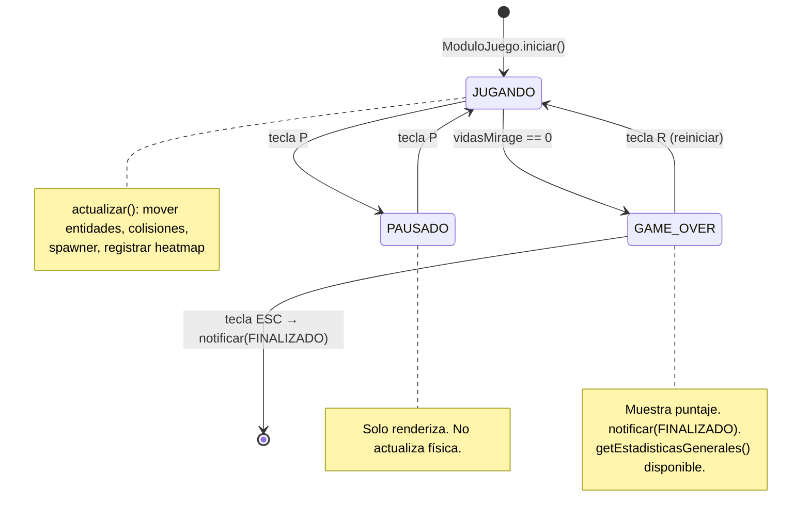
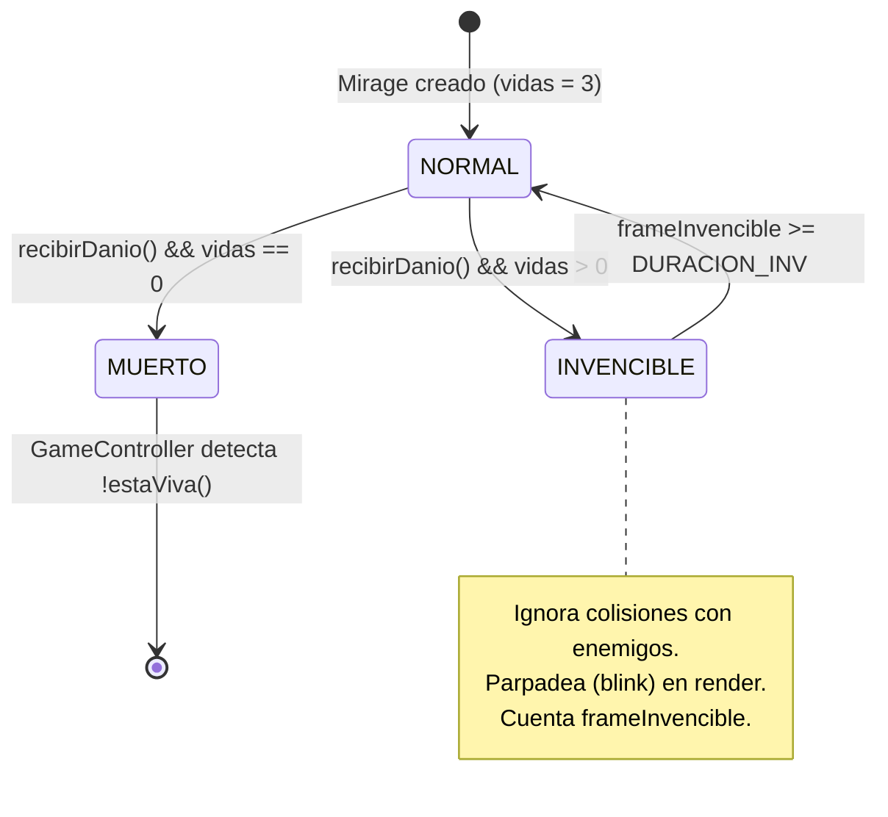
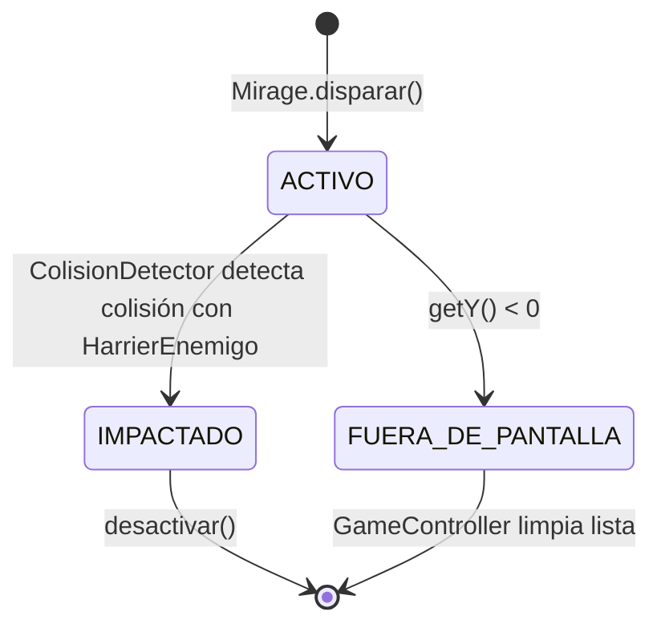
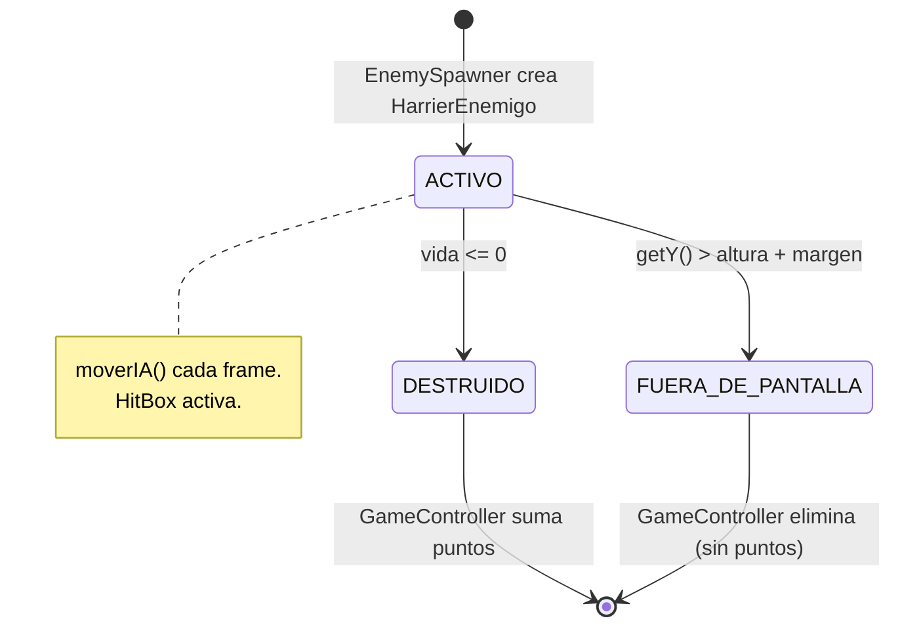

# Diagramas de Estado — MVP 1

> Vista de comportamiento dinámico del sistema en la primera versión entregable

---

## 1. Estado del Juego

| Estado | Clase Java |
|--------|-----------|
| JUGANDO | `EstadoJugando` |
| PAUSADO | `EstadoPausado` |
| GAME_OVER | `EstadoGameOver` |
| Transiciones | `GameController.setEstado()` |

---

## 2. Estado del Mirage

---

## 3. Estado de un Proyectil

---

## 4. Estado de un HarrierEnemigo

