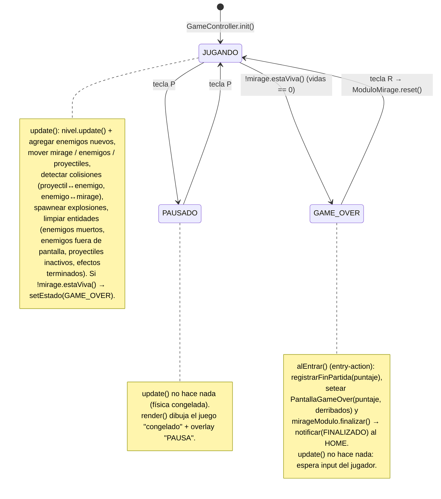
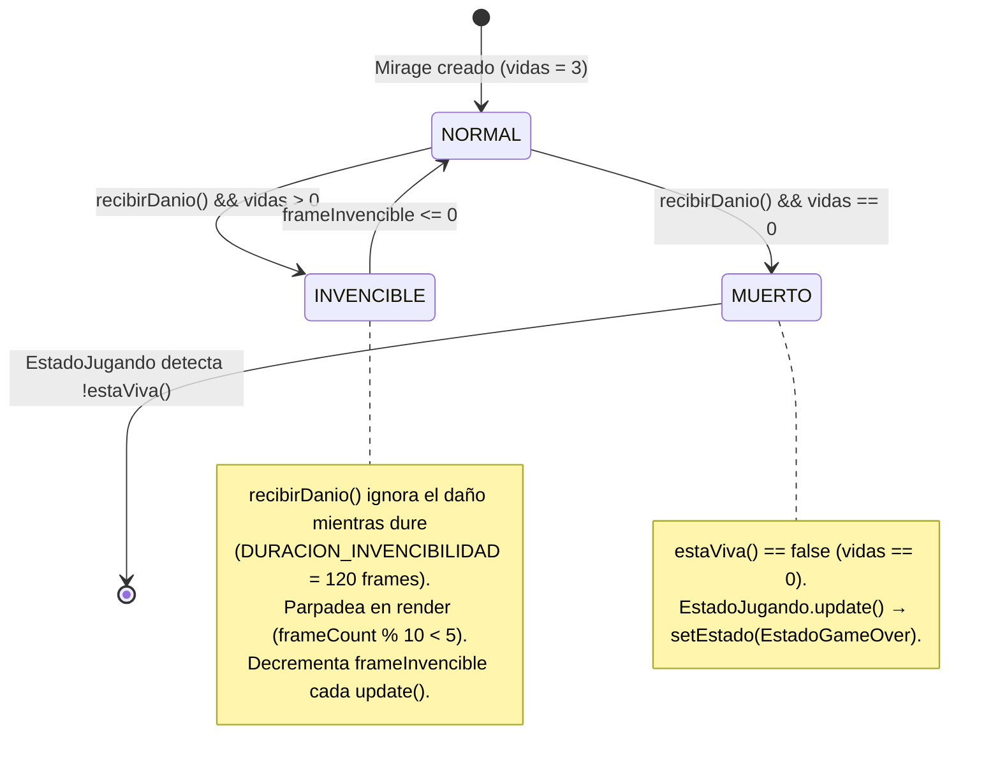
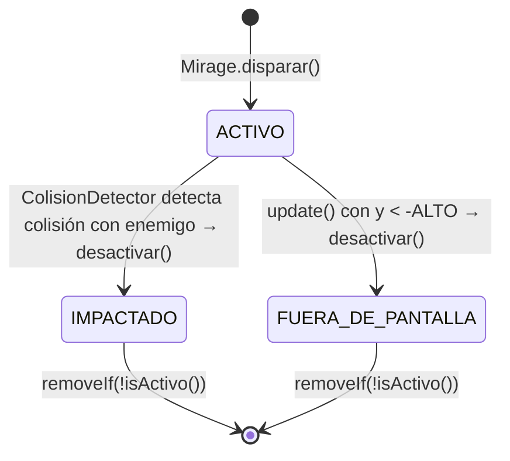

# Diagramas de Estado — MVP 1

> Vista de comportamiento dinámico del sistema en la primera versión entregable

---

## 1. Estado del Juego

> El ciclo de vida del HOME (NO_INICIADO → INICIANDO → EN_EJECUCION ↔ PAUSADO →
> FINALIZADO) vive en `ModuloMirage` y es independiente de esta máquina interna.
> `ModuloMirage.iniciar()` solo lleva el ciclo del HOME a `IniciandoState`; quien
> entra a `JUGANDO` es `GameController.init()` vía `setEstado(new EstadoJugando())`.
> La tecla **ESC** y el cierre los intercepta el HOME/lobby, **no** este estado.

| Estado | Clase Java |
|--------|-----------|
| JUGANDO | `EstadoJugando` |
| PAUSADO | `EstadoPausado` |
| GAME_OVER | `EstadoGameOver` |
| Transiciones | `GameController.setEstado()` (llama `alEntrar()` del nuevo estado) |

---

## 2. Estado del Mirage

> Nota: estando INVENCIBLE el Mirage no recibe daño porque `recibirDanio()`
> retorna temprano (`if (invencible) return;`); además `ColisionDetector`
> ignora la colisión enemigo↔Mirage cuando `mirage.isInvencible()`.

---

## 3. Estado de un Proyectil

> Ambas transiciones terminan poniendo `activo = false` (vía `desactivar()`).
> La eliminación de la lista la hacen los `removeIf(!p.isActivo())` de
> `Mirage.update()` y `EstadoJugando.update()`, no el `GameController` directamente.

---

## 4. Estado de un HarrierEnemigo

```mermaid
stateDiagram-v2
    [*] --> ACTIVO : EnemySpawner crea HarrierEnemigo

    ACTIVO --> DESTRUIDO : vida <= 0 (!estaViva())
    ACTIVO --> FUERA_DE_PANTALLA : getY() > sketch.height + 40

    DESTRUIDO --> [*] : EstadoJugando spawnea Explosion y elimina; ColisionDetector ya sumó puntos
    FUERA_DE_PANTALLA --> [*] : EstadoJugando elimina (sin puntos)

    note right of ACTIVO
        update() → moverIA() cada frame
        (zigzag horizontal + descenso). HitBox activa.
        Los puntos (PUNTOS_VALOR = 100) los suma
        ColisionDetector al destruir el enemigo.
    end note
```

> Ambas transiciones de salida las ejecuta `EstadoJugando.update()` mediante
> `removeIf(...)`: una por `!estaViva()` (vida ≤ 0) y otra por
> `getY() > sketch.height + 40`. El puntaje se acredita antes, en
> `ColisionDetector.detectarProyectilEnemigo()`, vía `mirage.sumarPuntos()` y
> `estadisticas.registrarDerribo()`.
